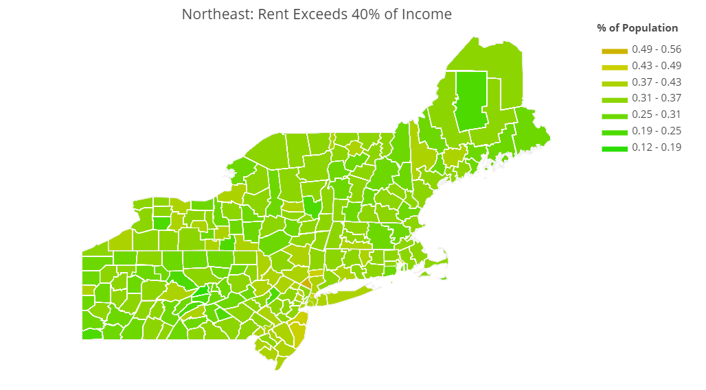
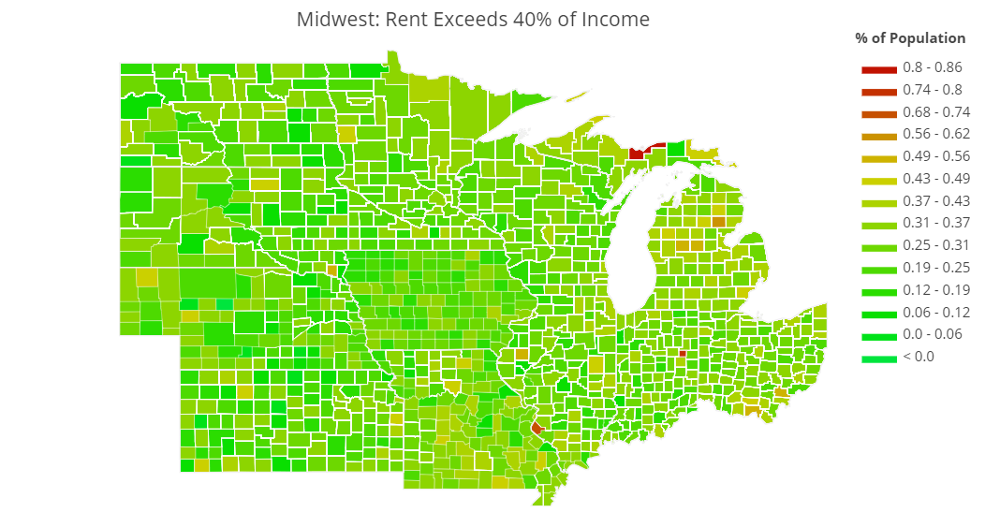
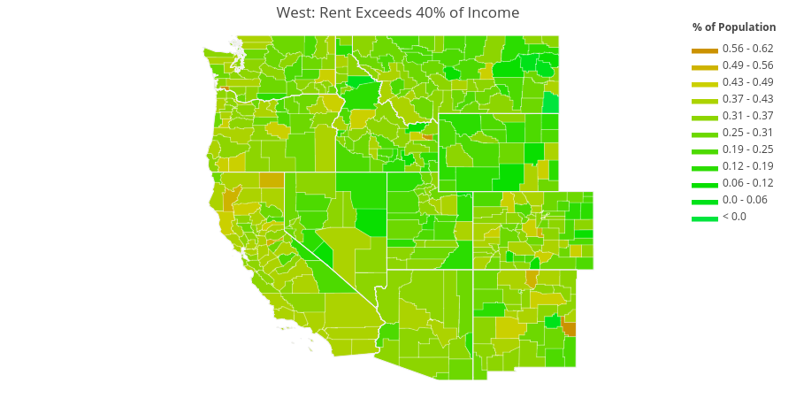
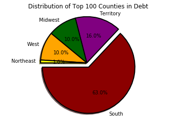

# Debt to Income Ratio

Working in the mortgage industry had me wondering about how many people in the United States are currently able to qualify for a home loan. I found a dataset on Kaggle which aggregated household debt and home price to create an average debt-to-income ratio for each county. In order to get a qualified mortgage, one must have a debt- to income ratio of under 40%. Anything above that would be living above one's means. Using this information, I created the below visualizations.

I discovered that the Southern US has the highest percentage of people living above their means. This could be due to a number of factors: salaries not increasing as fast as the rising cost of housing, lack of jobs, people choosing houses they cannot afford, etc.


```python
import pandas as pd
import numpy as np
import matplotlib.pyplot as plt
import plotly
from config import user, apikey
plotly.tools.set_credentials_file(username=user, api_key=apikey)
import plotly.plotly as py
import plotly.figure_factory as ff
from IPython.display import Image

data = pd.read_csv("real_estate_db.csv", encoding='ISO-8859-1')
all_fips = pd.read_csv("all-geocodes-v2016.csv", encoding='ISO-8859-1')
```

First, I imported the data to examine what I had. I chose to use the column "rent_gt_40", which represents the percentage of residents whose rent exceeds 40% of their income. To graph this data in a choropleth, plotly requires a FIPS code (Federal Information Processing Standard), representing a unique state/county location. I cleaned the columns into a format that plotly would accept below.


```python
rent_40_df = data[["rent_gt_40", 'STATEID', "COUNTYID", "state"]]
rent_40_df.head()
```


<div>
<table border="1" class="dataframe">
  <thead>
    <tr style="text-align: right;">
      <th></th>
      <th>rent_gt_40</th>
      <th>STATEID</th>
      <th>COUNTYID</th>
      <th>state</th>
    </tr>
  </thead>
  <tbody>
    <tr>
      <th>0</th>
      <td>0.15135</td>
      <td>2</td>
      <td>16</td>
      <td>Alaska</td>
    </tr>
    <tr>
      <th>1</th>
      <td>0.20455</td>
      <td>2</td>
      <td>20</td>
      <td>Alaska</td>
    </tr>
    <tr>
      <th>2</th>
      <td>0.54368</td>
      <td>2</td>
      <td>20</td>
      <td>Alaska</td>
    </tr>
    <tr>
      <th>3</th>
      <td>0.27286</td>
      <td>2</td>
      <td>20</td>
      <td>Alaska</td>
    </tr>
    <tr>
      <th>4</th>
      <td>0.24829</td>
      <td>2</td>
      <td>20</td>
      <td>Alaska</td>
    </tr>
  </tbody>
</table>
</div>


```python
rent_40_df.loc[:,"STATEID"] = rent_40_df["STATEID"].map("{:02d}".format)
rent_40_df.loc[:,"COUNTYID"] = rent_40_df["COUNTYID"].map("{:003d}".format)
rent_40_df["FIPS"] = rent_40_df["STATEID"].map(str) + rent_40_df["COUNTYID"].map(str)
rent_40_clean = rent_40_df.dropna(how='any')
```


```python
grouped_data = rent_40_clean.groupby(["FIPS"])
mean_rent_40 = grouped_data.mean().reset_index()
```


```python
#Add leading zeros to federal geocodes dataframe
all_fips.loc[:,"State Code (FIPS)"] = all_fips["State Code (FIPS)"].map("{:02d}".format)
all_fips.loc[:,"County Code (FIPS)"] = all_fips["County Code (FIPS)"].map("{:003d}".format)

all_fips["FIPS"] = all_fips["State Code (FIPS)"].map(str) + all_fips["County Code (FIPS)"].map(str)

county_fips = all_fips[all_fips["County Code (FIPS)"] != "000"].reset_index()
clean_fips = county_fips[["FIPS"]]
```

Some counties were missing data. I chose to fill those counties with the median percentage value.


```python
#Merge to include missing counties
merge_table = pd.merge(clean_fips, mean_rent_40, how="outer")

#Fill missing counties with median
merge_table["rent_gt_40"].fillna(mean_rent_40["rent_gt_40"].median(), inplace=True)

merge_table.head()
```


<div>
<table border="1" class="dataframe">
  <thead>
    <tr style="text-align: right;">
      <th></th>
      <th>FIPS</th>
      <th>rent_gt_40</th>
    </tr>
  </thead>
  <tbody>
    <tr>
      <th>0</th>
      <td>01001</td>
      <td>0.348900</td>
    </tr>
    <tr>
      <th>1</th>
      <td>01003</td>
      <td>0.312674</td>
    </tr>
    <tr>
      <th>2</th>
      <td>01005</td>
      <td>0.386574</td>
    </tr>
    <tr>
      <th>3</th>
      <td>01007</td>
      <td>0.254480</td>
    </tr>
    <tr>
      <th>4</th>
      <td>01009</td>
      <td>0.361050</td>
    </tr>
  </tbody>
</table>
</div>


I ran into several limitations with plotly at this stage. 
* First, I encountered a runtime error due to such a large amount of data. I realized that I could not create one visualization of the full United States. I opted to break up the country into its main regions: Northeast, Midwest, South, and West.
* Additionally, I found that the sheer size of Alaska and distance of Hawaii forced the West plot to become too small to read. I made the decision to not include those two states in the West visualization.


```python
northeast = merge_table.loc[merge_table["FIPS"].str[:2].isin(
    ["09", "23", "25", "33", "44", "50", "34", "36", "42"]
)].reset_index(drop=True)

midwest = merge_table.loc[merge_table["FIPS"].str[:2].isin(
    ["17", "18", "26", "39", "55", "19", "20", "27", "29", "31", "38", "46"]
)].reset_index(drop=True)

south = merge_table.loc[merge_table["FIPS"].str[:2].isin(
    ["10", "11", "12", "13", "24", "37", "45", "51", "54", "01", "21", "28", "47", "05", "22", "40", "48"]
)].reset_index(drop=True)

west = merge_table.loc[merge_table["FIPS"].str[:2].isin(
    ["04", "08", "16", "30", "32", "35", "49", "56", "06", "41", "53"]
)].reset_index(drop=True)
```

# Northeast

Connecticut, Maine, Massachusetts, New Hampshire, New Jersey, Vermont, New York, and Pennsylvania.


```python
colorscale = ["00E53D","00E219","09DF00","2BDD00","4DDA00","6DD800","8DD500","ACD300",\
              "CBD000","CEB300","CB9200","C97100","C65000","C43100","C11200","BF000A"]    
    
endpts = list(np.linspace(0, 0.86364, len(colorscale) - 1))
fips = northeast["FIPS"]
values = northeast["rent_gt_40"]
scope = ["Connecticut", "Maine", "Massachusetts", "New Hampshire", "New Jersey", "Vermont", "New York", "Pennsylvania"]

fig = ff.create_choropleth(fips=fips, values=values, binning_endpoints=endpts, scope=scope,
                           colorscale=colorscale, county_outline={'color': 'rgb(255,255,255)', 'width': 0.25},
                          title='Northeast: Rent Exceeds 40% of Income',
                          legend_title='% of Population')
py.image.save_as(fig, filename='northeast.png')
py.iplot(fig, filename='northeast')
```




# Midwest

Illinois, Indiana, Michigan, Ohio, Wisconsin, Kansas, Minnesota, Missouri, Nebraska, North Dakota, and South Dakota.


```python
colorscale = ["00E53D","00E219","09DF00","2BDD00","4DDA00","6DD800","8DD500","ACD300",\
              "CBD000","CEB300","CB9200","C97100","C65000","C43100","C11200","BF000A"]    
    
endpts = list(np.linspace(0, 0.86364, len(colorscale) - 1))
fips = midwest["FIPS"]
values = midwest["rent_gt_40"]
scope = ["Illinois", "Indiana", "Michigan", "Ohio", "Wisconsin", "Kansas", "Minnesota", \
         "Missouri", "Nebraska", "North Dakota", "South Dakota"]

fig = ff.create_choropleth(fips=fips, values=values, binning_endpoints=endpts, scope=scope,
                           colorscale=colorscale, county_outline={'color': 'rgb(255,255,255)', 'width': 0.25},
                          title='Midwest: Rent Exceeds 40% of Income',
                          legend_title='% of Population')
py.image.save_as(fig, filename='midwest.png')
py.iplot(fig, filename='midwest')
```



# South

Delaware, District of Columbia, Florida, Georgia, Maryland, North Carolina, South Carolina, Virginia, West Virginia, Alabama, Kentucky, Mississippi, Tennessee, Arkansas, Louisiana, Oklahoma, and Texas.


```python
colorscale = ["00E53D","00E219","09DF00","2BDD00","4DDA00","6DD800","8DD500","ACD300",\
              "CBD000","CEB300","CB9200","C97100","C65000","C43100","C11200","BF000A"]    
    
endpts = list(np.linspace(0, 0.86364, len(colorscale) - 1))
fips = south["FIPS"]
values = south["rent_gt_40"]
scope = ["Delaware", "District of Columbia", "Florida", "Georgia", "Maryland", "North Carolina", \
         "South Carolina", "Virginia", "West Virginia", "Alabama", "Kentucky", "Mississippi", "Tennessee", \
         "Arkansas", "Louisiana", "Oklahoma", "Texas"]

fig = ff.create_choropleth(fips=fips, values=values, binning_endpoints=endpts, scope=scope,
                           colorscale=colorscale, county_outline={'color': 'rgb(255,255,255)', 'width': 0.25},
                          title='South: Rent Exceeds 40% of Income',
                          legend_title='% of Population')
py.image.save_as(fig, filename='south.png')
py.iplot(fig, filename='south')
```


# West

Arizona, Colorado, Idaho, Montana, Nevada, New Mexico, Utah, Wyoming, California, Oregon, and Washington.


```python
colorscale = ["00E53D","00E219","09DF00","2BDD00","4DDA00","6DD800","8DD500","ACD300",\
              "CBD000","CEB300","CB9200","C97100","C65000","C43100","C11200","BF000A"]    
    
endpts = list(np.linspace(0, 0.86364, len(colorscale) - 1))
fips = west["FIPS"]
values = west["rent_gt_40"]
scope = ["Arizona", "Colorado", "Idaho", "Montana", "Nevada", "New Mexico", "Utah", "Wyoming", \
         "California", "Oregon", "Washington"]

fig = ff.create_choropleth(fips=fips, values=values, binning_endpoints=endpts, scope=scope,
                           colorscale=colorscale, county_outline={'color': 'rgb(255,255,255)', 'width': 0.25},
                          title='West: Rent Exceeds 40% of Income',
                          legend_title='% of Population')
py.image.save_as(fig, filename='west.png')
py.iplot(fig, filename='west')
```



# Top 100 Counties

After viewing these choropleths, my next question was: 
* Which region is struggling the most? 

I proceeded to collect the 100 counties with the highest debt-to-income ratio into a pie chart. It is clear that the South has the most counties in peril at 63 in total. The remaining regions combined make up the final third of the top 100. Unfortunately Plotly does not have the ability to show US territories which make up the next highest region at 16%.


```python
top_100 = mean_rent_40.sort_values(["rent_gt_40"], ascending = False).head(100).reset_index(drop = True)
```


```python
northeast = 0
midwest = 0
south = 0
west = 0
territory = 0

for value in top_100["FIPS"]:
    if value[:2] in ("09", "23", "25", "33", "44", "50", "34", "36", "42"):
        northeast += 1
    elif value[:2] in ("17", "18", "26", "39", "55", "19", "20", "27", "29", "31", "38", "46"):
        midwest += 1
    elif value[:2] in ("10", "11", "12", "13", "24", "37", "45", "51", "54", "01", "21", "28", "47", "05", "22", "40", "48"):
        south += 1
    elif value[:2] in ("04", "08", "16", "30", "32", "35", "49", "56", "02", "06", "15", "41", "53"):
        west += 1
    else:
        territory += 1
```


```python
labels = ["South", "Territory", "Midwest", "West", "Northeast"]
sizes = [south, territory, midwest, west, northeast]
colors = ["darkred", "purple", "darkgreen", "orange", "yellow"]
explode = (0.1, 0, 0, 0, 0)

plt.pie(sizes, explode=explode, labels=labels, colors=colors, autopct="%1.1f%%", shadow=True, startangle=180,
       wedgeprops={"edgecolor":"k",'linewidth': 2})

plt.axis("equal")
plt.title("Distribution of Top 100 Counties in Debt")
plt.show()
```




