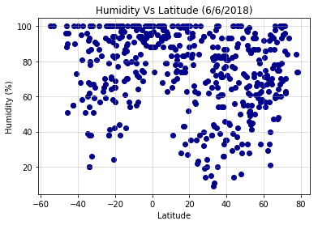
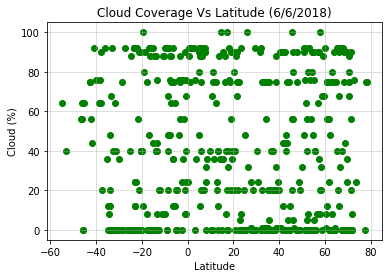
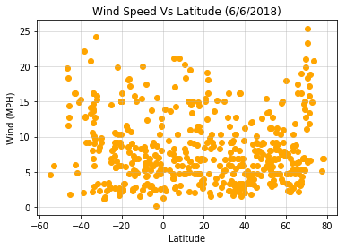

# WeatherPy

This project was focused on working with API calls. My goal was to get various information about a city’s weather (temperature, humidity, cloud coverage, and wind speed) and see how they relate to its latitude. Constraints included making sure each city was unique and that it existed in all APIs I planned to use.

Notable findings: 
* Temperature and nearness to the equator are highly corrolated; the closer to 0 degress latitude, the higher the temperature.
* Cloud coverage is not affected by the city's closeness to the equator
* The closer a city is to either pole, the more likely its humidity in nearer to 100%.


```python
import pandas as pd
import numpy as np
import random
import openweathermapy.core as owm
from config import api_key
from config import gkey
import csv
import matplotlib.pyplot as plt
import requests
import json
from citipy import citipy
```

To generate the data, I first created a random set of 500 unique latitudes and longitudes. I then used the python library citipy to get the coordinate’s closest corresponding city. It was at this point I realized there might be a problem: what happens if the random coordinate point was in the ocean, and therefore the nearest city was hundreds of miles away? To account for this, I fed the city name into Google’s API to retrieve its true coordinates. Once I had generated 500 unique cities and coordinates, I used the library openweathermappy to retrieve weather data from Openweathermap.org. Matplotlib was used to display the results.


```python
#Creating random set of 500 unique latitudes, longitudes, and corresponding city name
city_dict = {}
city_names = []
lat = []
lng = []
count = 0

while len(city_names) < 500:
    
    #Random latitudes/longitudes
    lat_try = random.randint(-900000,900000)/10000
    lng_try = random.randint(-1800000,1800000)/10000
    
    #Nearest city to those coordinates
    city = citipy.nearest_city(lat_try, lng_try).city_name
    country = citipy.nearest_city(lat_try, lng_try).country_code
    city_country = city + ", " + country
    
    #Find the city's true coordinates with Google API
    target_url = "https://maps.googleapis.com/maps/api/geocode/json?address=%s&key=%s" % (city_country, gkey)
    city_coord = requests.get(target_url).json()
    
    #Checking if city exists in Google search results
    if city_coord["status"] != "ZERO_RESULTS":
        
        #Adding only unique cities to list
        if city not in city_dict: #searching through dict instead of list to speed up processing time
            city_dict[city] = 0
            city_names.append(city)
            lat.append(city_coord["results"][0]["geometry"]["location"]["lat"])
            lng.append(city_coord["results"][0]["geometry"]["location"]["lng"])
            
            count += 1
            print(f"Retrieving Google results for city {count}: {city}.")
```

    Retrieving Google results for city 1: cape town.
    Retrieving Google results for city 2: kaitangata.
    Retrieving Google results for city 3: chokurdakh.
    Retrieving Google results for city 4: provideniya.
    Retrieving Google results for city 5: punta arenas.
    Retrieving Google results for city 6: albany.
    Retrieving Google results for city 7: rikitea.
    Retrieving Google results for city 8: kapaa.
    Retrieving Google results for city 9: yuza.
    Retrieving Google results for city 10: khorixas.
    Retrieving Google results for city 11: new norfolk.
    Retrieving Google results for city 12: castro.
    Retrieving Google results for city 13: ushuaia.
    Retrieving Google results for city 14: albury.
    Retrieving Google results for city 15: puerto ayora.
    Retrieving Google results for city 16: esperance.
    Retrieving Google results for city 17: mataura.
    Retrieving Google results for city 18: hithadhoo.
    Retrieving Google results for city 19: henties bay.
    Retrieving Google results for city 20: luanda.
    Retrieving Google results for city 21: corinto.
    Retrieving Google results for city 22: mandalgovi.
    Retrieving Google results for city 23: dwarka.
    Retrieving Google results for city 24: hobart.
    Retrieving Google results for city 25: flinders.
    Retrieving Google results for city 26: lebu.
    Retrieving Google results for city 27: hermanus.
    Retrieving Google results for city 28: grand-lahou.
    Retrieving Google results for city 29: tavda.
    Retrieving Google results for city 30: solnechnyy.
    Retrieving Google results for city 31: karup.
    Retrieving Google results for city 32: qaanaaq.
    Retrieving Google results for city 33: cherskiy.
    Retrieving Google results for city 34: bathsheba.
    Retrieving Google results for city 35: oxelosund.
    Retrieving Google results for city 36: kongoussi.
    Retrieving Google results for city 37: tabiauea.
    Retrieving Google results for city 38: manta.
    Retrieving Google results for city 39: wajima.
    Retrieving Google results for city 40: taolanaro.
    Retrieving Google results for city 41: vaini.
    Retrieving Google results for city 42: hilo.
    Retrieving Google results for city 43: cockburn town.
    Retrieving Google results for city 44: busselton.
    Retrieving Google results for city 45: mar del plata.
    Retrieving Google results for city 46: dunedin.
    Retrieving Google results for city 47: varnavino.
    Retrieving Google results for city 48: talnakh.
    Retrieving Google results for city 49: quatre cocos.
    Retrieving Google results for city 50: sebastian.
    Retrieving Google results for city 51: armacao dos buzios.
    Retrieving Google results for city 52: nome.
    Retrieving Google results for city 53: mayo.
    Retrieving Google results for city 54: barrow.
    Retrieving Google results for city 55: tual.
    Retrieving Google results for city 56: asau.
    Retrieving Google results for city 57: port keats.
    Retrieving Google results for city 58: shimoda.
    Retrieving Google results for city 59: yellowknife.
    Retrieving Google results for city 60: bethel.
    Retrieving Google results for city 61: mayumba.
    Retrieving Google results for city 62: san quintin.
    Retrieving Google results for city 63: umzimvubu.
    Retrieving Google results for city 64: hofn.
    Retrieving Google results for city 65: huarmey.
    Retrieving Google results for city 66: kahului.
    Retrieving Google results for city 67: kuche.
    Retrieving Google results for city 68: dikson.
    Retrieving Google results for city 69: san luis.
    Retrieving Google results for city 70: iqaluit.
    Retrieving Google results for city 71: caravelas.
    Retrieving Google results for city 72: jamestown.
    Retrieving Google results for city 73: ivanteyevka.
    Retrieving Google results for city 74: bredasdorp.
    Retrieving Google results for city 75: yarmouth.
    Retrieving Google results for city 76: bluff.
    Retrieving Google results for city 77: ponta do sol.
    Retrieving Google results for city 78: cetraro.
    Retrieving Google results for city 79: arraial do cabo.
    Retrieving Google results for city 80: ponta delgada.
    Retrieving Google results for city 81: severo-kurilsk.
    Retrieving Google results for city 82: kodiak.
    Retrieving Google results for city 83: amderma.
    Retrieving Google results for city 84: tumannyy.
    Retrieving Google results for city 85: te anau.
    Retrieving Google results for city 86: ribeira grande.
    Retrieving Google results for city 87: east london.
    Retrieving Google results for city 88: akyab.
    Retrieving Google results for city 89: tasiilaq.
    Retrieving Google results for city 90: eenhana.
    Retrieving Google results for city 91: acarau.
    Retrieving Google results for city 92: atuona.
    Retrieving Google results for city 93: camacha.
    Retrieving Google results for city 94: carnarvon.
    Retrieving Google results for city 95: khatanga.
    Retrieving Google results for city 96: vaitupu.
    Retrieving Google results for city 97: lady frere.
    Retrieving Google results for city 98: eyl.
    Retrieving Google results for city 99: verkhnevilyuysk.
    Retrieving Google results for city 100: barentsburg.
    Retrieving Google results for city 101: mount isa.
    Retrieving Google results for city 102: san francisco.
    Retrieving Google results for city 103: huilong.
    Retrieving Google results for city 104: santona.
    Retrieving Google results for city 105: souillac.
    Retrieving Google results for city 106: flic en flac.
    Retrieving Google results for city 107: kyaukse.
    Retrieving Google results for city 108: wheeling.
    Retrieving Google results for city 109: husavik.
    Retrieving Google results for city 110: cidreira.
    Retrieving Google results for city 111: lonavale.
    Retrieving Google results for city 112: sorland.
    Retrieving Google results for city 113: hasaki.
    Retrieving Google results for city 114: aykhal.
    Retrieving Google results for city 115: shelburne.
    Retrieving Google results for city 116: fortuna.
    Retrieving Google results for city 117: pevek.
    Retrieving Google results for city 118: alofi.
    Retrieving Google results for city 119: arica.
    Retrieving Google results for city 120: emerald.
    Retrieving Google results for city 121: medzilaborce.
    Retrieving Google results for city 122: dingle.
    Retrieving Google results for city 123: tuktoyaktuk.
    Retrieving Google results for city 124: atambua.
    Retrieving Google results for city 125: attawapiskat.
    Retrieving Google results for city 126: taltal.
    Retrieving Google results for city 127: port elizabeth.
    Retrieving Google results for city 128: isangel.
    Retrieving Google results for city 129: san jose.
    Retrieving Google results for city 130: manicore.
    Retrieving Google results for city 131: saint anthony.
    Retrieving Google results for city 132: udachnyy.
    Retrieving Google results for city 133: constitucion.
    Retrieving Google results for city 134: canton.
    Retrieving Google results for city 135: gejiu.
    Retrieving Google results for city 136: gazojak.
    Retrieving Google results for city 137: mbanza-ngungu.
    Retrieving Google results for city 138: qaqortoq.
    Retrieving Google results for city 139: shingu.
    Retrieving Google results for city 140: saskylakh.
    Retrieving Google results for city 141: victoria.
    Retrieving Google results for city 142: clyde river.
    Retrieving Google results for city 143: kruisfontein.
    Retrieving Google results for city 144: butaritari.
    Retrieving Google results for city 145: bonavista.
    Retrieving Google results for city 146: saint-philippe.
    Retrieving Google results for city 147: nikolskoye.
    Retrieving Google results for city 148: vila velha.
    Retrieving Google results for city 149: margate.
    Retrieving Google results for city 150: blackwater.
    Retrieving Google results for city 151: warrington.
    Retrieving Google results for city 152: fairbanks.
    Retrieving Google results for city 153: illoqqortoormiut.
    Retrieving Google results for city 154: svetlyy.
    Retrieving Google results for city 155: rong kwang.
    Retrieving Google results for city 156: lobez.
    Retrieving Google results for city 157: acapulco.
    Retrieving Google results for city 158: macaboboni.
    Retrieving Google results for city 159: adrar.
    Retrieving Google results for city 160: acoua.
    Retrieving Google results for city 161: aklavik.
    Retrieving Google results for city 162: scarborough.
    Retrieving Google results for city 163: richards bay.
    Retrieving Google results for city 164: pedernales.
    Retrieving Google results for city 165: rio grande.
    Retrieving Google results for city 166: grand river south east.
    Retrieving Google results for city 167: port alfred.
    Retrieving Google results for city 168: belushya guba.
    Retrieving Google results for city 169: saldanha.
    Retrieving Google results for city 170: derzhavinsk.
    Retrieving Google results for city 171: parnamirim.
    Retrieving Google results for city 172: puerto colombia.
    Retrieving Google results for city 173: cayenne.
    Retrieving Google results for city 174: kavaratti.
    Retrieving Google results for city 175: lamongan.
    Retrieving Google results for city 176: thompson.
    Retrieving Google results for city 177: airai.
    Retrieving Google results for city 178: homer.
    Retrieving Google results for city 179: ormara.
    Retrieving Google results for city 180: vestmannaeyjar.
    Retrieving Google results for city 181: san borja.
    Retrieving Google results for city 182: avarua.
    Retrieving Google results for city 183: tiksi.
    Retrieving Google results for city 184: concepcion.
    Retrieving Google results for city 185: bhiwani.
    Retrieving Google results for city 186: goba.
    Retrieving Google results for city 187: ust-kuyga.
    Retrieving Google results for city 188: mys shmidta.
    Retrieving Google results for city 189: seoul.
    Retrieving Google results for city 190: berlevag.
    Retrieving Google results for city 191: belyy yar.
    Retrieving Google results for city 192: kabansk.
    Retrieving Google results for city 193: malinovskiy.
    Retrieving Google results for city 194: ijaki.
    Retrieving Google results for city 195: ojinaga.
    Retrieving Google results for city 196: cap malheureux.
    Retrieving Google results for city 197: geraldton.
    Retrieving Google results for city 198: bengkulu.
    Retrieving Google results for city 199: savinskiy.
    Retrieving Google results for city 200: paramonga.
    Retrieving Google results for city 201: saint-francois.
    Retrieving Google results for city 202: ketchikan.
    Retrieving Google results for city 203: yeppoon.
    Retrieving Google results for city 204: veraval.
    Retrieving Google results for city 205: ha giang.
    Retrieving Google results for city 206: fort-shevchenko.
    Retrieving Google results for city 207: luderitz.
    Retrieving Google results for city 208: stoyba.
    Retrieving Google results for city 209: grand gaube.
    Retrieving Google results for city 210: impfondo.
    Retrieving Google results for city 211: darab.
    Retrieving Google results for city 212: bosaso.
    Retrieving Google results for city 213: banda.
    Retrieving Google results for city 214: giyani.
    Retrieving Google results for city 215: pangnirtung.
    Retrieving Google results for city 216: sao filipe.
    Retrieving Google results for city 217: schwarzenbek.
    Retrieving Google results for city 218: bilibino.
    Retrieving Google results for city 219: nizhneyansk.
    Retrieving Google results for city 220: longyearbyen.
    Retrieving Google results for city 221: los llanos de aridane.
    Retrieving Google results for city 222: nanortalik.
    Retrieving Google results for city 223: padang.
    Retrieving Google results for city 224: namatanai.
    Retrieving Google results for city 225: lorengau.
    Retrieving Google results for city 226: lufilufi.
    Retrieving Google results for city 227: beringovskiy.
    Retrieving Google results for city 228: wanganui.
    Retrieving Google results for city 229: khowst.
    Retrieving Google results for city 230: iquique.
    Retrieving Google results for city 231: kamaishi.
    Retrieving Google results for city 232: sitka.
    Retrieving Google results for city 233: camana.
    Retrieving Google results for city 234: hay river.
    Retrieving Google results for city 235: huntington.
    Retrieving Google results for city 236: omboue.
    Retrieving Google results for city 237: mahebourg.
    Retrieving Google results for city 238: ilulissat.
    Retrieving Google results for city 239: wanlaweyn.
    Retrieving Google results for city 240: manchester.
    Retrieving Google results for city 241: jugas.
    Retrieving Google results for city 242: bubaque.
    Retrieving Google results for city 243: nogliki.
    Retrieving Google results for city 244: saleaula.
    Retrieving Google results for city 245: comodoro rivadavia.
    Retrieving Google results for city 246: buchanan.
    Retrieving Google results for city 247: krasnofarfornyy.
    Retrieving Google results for city 248: khrystynivka.
    Retrieving Google results for city 249: chagda.
    Retrieving Google results for city 250: koulikoro.
    Retrieving Google results for city 251: beisfjord.
    Retrieving Google results for city 252: georgetown.
    Retrieving Google results for city 253: lyuban.
    Retrieving Google results for city 254: mount gambier.
    Retrieving Google results for city 255: norman wells.
    Retrieving Google results for city 256: talara.
    Retrieving Google results for city 257: yinchuan.
    Retrieving Google results for city 258: anloga.
    Retrieving Google results for city 259: agadez.
    Retrieving Google results for city 260: westpunt.
    Retrieving Google results for city 261: gigmoto.
    Retrieving Google results for city 262: kloulklubed.
    Retrieving Google results for city 263: lata.
    Retrieving Google results for city 264: santa paula.
    Retrieving Google results for city 265: vanimo.
    Retrieving Google results for city 266: ngaoundere.
    Retrieving Google results for city 267: abu samrah.
    Retrieving Google results for city 268: makokou.
    Retrieving Google results for city 269: sabratah.
    Retrieving Google results for city 270: tongzhou.
    Retrieving Google results for city 271: sakaiminato.
    Retrieving Google results for city 272: deputatskiy.
    Retrieving Google results for city 273: santa cruz cabralia.
    Retrieving Google results for city 274: noumea.
    Retrieving Google results for city 275: little current.
    Retrieving Google results for city 276: ocampo.
    Retrieving Google results for city 277: srednekolymsk.
    Retrieving Google results for city 278: alyangula.
    Retrieving Google results for city 279: hualmay.
    Retrieving Google results for city 280: khani.
    Retrieving Google results for city 281: portland.
    Retrieving Google results for city 282: oktyabrskiy.
    Retrieving Google results for city 283: tsihombe.
    Retrieving Google results for city 284: konigslutter.
    Retrieving Google results for city 285: ahuimanu.
    Retrieving Google results for city 286: birjand.
    Retrieving Google results for city 287: tulun.
    Retrieving Google results for city 288: sur.
    Retrieving Google results for city 289: danielskuil.
    Retrieving Google results for city 290: balaka.
    Retrieving Google results for city 291: verrettes.
    Retrieving Google results for city 292: myanaung.
    Retrieving Google results for city 293: mumbwa.
    Retrieving Google results for city 294: marcona.
    Retrieving Google results for city 295: george.
    Retrieving Google results for city 296: saint george.
    Retrieving Google results for city 297: sinnamary.
    Retrieving Google results for city 298: igarka.
    Retrieving Google results for city 299: mankono.
    Retrieving Google results for city 300: arusha.
    Retrieving Google results for city 301: tuatapere.
    Retrieving Google results for city 302: maragogi.
    Retrieving Google results for city 303: balimo.
    Retrieving Google results for city 304: miles city.
    Retrieving Google results for city 305: yellamanchili.
    Retrieving Google results for city 306: yeletskiy.
    Retrieving Google results for city 307: puerto carreno.
    Retrieving Google results for city 308: warqla.
    Retrieving Google results for city 309: tsabong.
    Retrieving Google results for city 310: maniitsoq.
    Retrieving Google results for city 311: tombouctou.
    Retrieving Google results for city 312: codrington.
    Retrieving Google results for city 313: petauke.
    Retrieving Google results for city 314: charlottetown.
    Retrieving Google results for city 315: haines junction.
    Retrieving Google results for city 316: prainha.
    Retrieving Google results for city 317: pozo colorado.
    Retrieving Google results for city 318: leh.
    Retrieving Google results for city 319: mumford.
    Retrieving Google results for city 320: lagoa.
    Retrieving Google results for city 321: itabira.
    Retrieving Google results for city 322: gardan diwal.
    Retrieving Google results for city 323: narsaq.
    Retrieving Google results for city 324: muzquiz.
    Retrieving Google results for city 325: mgachi.
    Retrieving Google results for city 326: santa maria da vitoria.
    Retrieving Google results for city 327: peterhead.
    Retrieving Google results for city 328: shreveport.
    Retrieving Google results for city 329: katsuura.
    Retrieving Google results for city 330: yuanping.
    Retrieving Google results for city 331: antsohihy.
    Retrieving Google results for city 332: ankang.
    Retrieving Google results for city 333: port macquarie.
    Retrieving Google results for city 334: verkhoyansk.
    Retrieving Google results for city 335: cambridge.
    Retrieving Google results for city 336: ahipara.
    Retrieving Google results for city 337: kavieng.
    Retrieving Google results for city 338: carutapera.
    Retrieving Google results for city 339: sao joao da barra.
    Retrieving Google results for city 340: borba.
    Retrieving Google results for city 341: faanui.
    Retrieving Google results for city 342: dergachi.
    Retrieving Google results for city 343: bowen.
    Retrieving Google results for city 344: wulanhaote.
    Retrieving Google results for city 345: knysna.
    Retrieving Google results for city 346: tilichiki.
    Retrieving Google results for city 347: patiya.
    Retrieving Google results for city 348: gofitskoye.
    Retrieving Google results for city 349: half moon bay.
    Retrieving Google results for city 350: pula.
    Retrieving Google results for city 351: cabo san lucas.
    Retrieving Google results for city 352: vega de alatorre.
    Retrieving Google results for city 353: raudeberg.
    Retrieving Google results for city 354: barinas.
    Retrieving Google results for city 355: meyungs.
    Retrieving Google results for city 356: taylorville.
    Retrieving Google results for city 357: kazalinsk.
    Retrieving Google results for city 358: bonthe.
    Retrieving Google results for city 359: samusu.
    Retrieving Google results for city 360: orocue.
    Retrieving Google results for city 361: qostanay.
    Retrieving Google results for city 362: denau.
    Retrieving Google results for city 363: ust-bolsheretsk.
    Retrieving Google results for city 364: lilongwe.
    Retrieving Google results for city 365: broome.
    Retrieving Google results for city 366: vila do maio.
    Retrieving Google results for city 367: hami.
    Retrieving Google results for city 368: mocuba.
    Retrieving Google results for city 369: ganzhou.
    Retrieving Google results for city 370: saint-augustin.
    Retrieving Google results for city 371: urumqi.
    Retrieving Google results for city 372: bugiri.
    Retrieving Google results for city 373: sirjan.
    Retrieving Google results for city 374: hirekerur.
    Retrieving Google results for city 375: torbat-e jam.
    Retrieving Google results for city 376: linqiong.
    Retrieving Google results for city 377: upernavik.
    Retrieving Google results for city 378: balsas.
    Retrieving Google results for city 379: kondinskoye.
    Retrieving Google results for city 380: sfantu gheorghe.
    Retrieving Google results for city 381: aswan.
    Retrieving Google results for city 382: arlit.
    Retrieving Google results for city 383: portobelo.
    Retrieving Google results for city 384: coquimbo.
    Retrieving Google results for city 385: itaperuna.
    Retrieving Google results for city 386: ancud.
    Retrieving Google results for city 387: auki.
    Retrieving Google results for city 388: laguna.
    Retrieving Google results for city 389: verkhnyaya inta.
    Retrieving Google results for city 390: port hardy.
    Retrieving Google results for city 391: benguela.
    Retrieving Google results for city 392: bambous virieux.
    Retrieving Google results for city 393: nabire.
    Retrieving Google results for city 394: san patricio.
    Retrieving Google results for city 395: zhengjiatun.
    Retrieving Google results for city 396: lixourion.
    Retrieving Google results for city 397: armenion.
    Retrieving Google results for city 398: betare oya.
    Retrieving Google results for city 399: biak.
    Retrieving Google results for city 400: bislig.
    Retrieving Google results for city 401: tahe.
    Retrieving Google results for city 402: mahibadhoo.
    Retrieving Google results for city 403: quelimane.
    Retrieving Google results for city 404: butembo.
    Retrieving Google results for city 405: evensk.
    Retrieving Google results for city 406: muncar.
    Retrieving Google results for city 407: praya.
    Retrieving Google results for city 408: chernyshevskiy.
    Retrieving Google results for city 409: port hedland.
    Retrieving Google results for city 410: shenjiamen.
    Retrieving Google results for city 411: najran.
    Retrieving Google results for city 412: gat.
    Retrieving Google results for city 413: maumere.
    Retrieving Google results for city 414: atar.
    Retrieving Google results for city 415: berdigestyakh.
    Retrieving Google results for city 416: paita.
    Retrieving Google results for city 417: viedma.
    Retrieving Google results for city 418: batagay-alyta.
    Retrieving Google results for city 419: amga.
    Retrieving Google results for city 420: vero beach.
    Retrieving Google results for city 421: hambantota.
    Retrieving Google results for city 422: axim.
    Retrieving Google results for city 423: aybak.
    Retrieving Google results for city 424: erzin.
    Retrieving Google results for city 425: freeport.
    Retrieving Google results for city 426: dukat.
    Retrieving Google results for city 427: iwanai.
    Retrieving Google results for city 428: fatehpur.
    Retrieving Google results for city 429: saquena.
    Retrieving Google results for city 430: santa barbara.
    Retrieving Google results for city 431: lavrentiya.
    Retrieving Google results for city 432: middelburg.
    Retrieving Google results for city 433: prince rupert.
    Retrieving Google results for city 434: mananjary.
    Retrieving Google results for city 435: muscat.
    Retrieving Google results for city 436: zachagansk.
    Retrieving Google results for city 437: warman.
    Retrieving Google results for city 438: tonekabon.
    Retrieving Google results for city 439: vila franca do campo.
    Retrieving Google results for city 440: la paz.
    Retrieving Google results for city 441: trebinje.
    Retrieving Google results for city 442: ipilan.
    Retrieving Google results for city 443: baykit.
    Retrieving Google results for city 444: nicoya.
    Retrieving Google results for city 445: port-gentil.
    Retrieving Google results for city 446: port augusta.
    Retrieving Google results for city 447: chuy.
    Retrieving Google results for city 448: la ronge.
    Retrieving Google results for city 449: cocobeach.
    Retrieving Google results for city 450: gifhorn.
    Retrieving Google results for city 451: korla.
    Retrieving Google results for city 452: minjur.
    Retrieving Google results for city 453: rocha.
    Retrieving Google results for city 454: tuggurt.
    Retrieving Google results for city 455: mezhova.
    Retrieving Google results for city 456: kirakira.
    Retrieving Google results for city 457: xichang.
    Retrieving Google results for city 458: kunzelsau.
    Retrieving Google results for city 459: matameye.
    Retrieving Google results for city 460: colares.
    Retrieving Google results for city 461: hobyo.
    Retrieving Google results for city 462: vao.
    Retrieving Google results for city 463: ginda.
    Retrieving Google results for city 464: boysun.
    Retrieving Google results for city 465: domoni.
    Retrieving Google results for city 466: torbay.
    Retrieving Google results for city 467: pacific grove.
    Retrieving Google results for city 468: dengfeng.
    Retrieving Google results for city 469: kandrian.
    Retrieving Google results for city 470: krasnokamensk.
    Retrieving Google results for city 471: aden.
    Retrieving Google results for city 472: zhezkazgan.
    Retrieving Google results for city 473: krasnogorskoye.
    Retrieving Google results for city 474: lethem.
    Retrieving Google results for city 475: kargat.
    Retrieving Google results for city 476: otjimbingwe.
    Retrieving Google results for city 477: tyumentsevo.
    Retrieving Google results for city 478: broken hill.
    Retrieving Google results for city 479: porto novo.
    Retrieving Google results for city 480: kenai.
    Retrieving Google results for city 481: san cristobal.
    Retrieving Google results for city 482: pringsewu.
    Retrieving Google results for city 483: puhja.
    Retrieving Google results for city 484: san bernardo.
    Retrieving Google results for city 485: vilcun.
    Retrieving Google results for city 486: kasongo-lunda.
    Retrieving Google results for city 487: bambanglipuro.
    Retrieving Google results for city 488: sao miguel do araguaia.
    Retrieving Google results for city 489: klaksvik.
    Retrieving Google results for city 490: talawdi.
    Retrieving Google results for city 491: vardo.
    Retrieving Google results for city 492: katherine.
    Retrieving Google results for city 493: pitimbu.
    Retrieving Google results for city 494: kieta.
    Retrieving Google results for city 495: sabang.
    Retrieving Google results for city 496: louisbourg.
    Retrieving Google results for city 497: ustyuzhna.
    Retrieving Google results for city 498: yar-sale.
    Retrieving Google results for city 499: russellville.
    Retrieving Google results for city 500: tevaitoa.
    


```python
all_weather = []

for index in range(0, len(city_names)):
    
    #Call API to check weather of each city
    url = f"http://api.openweathermap.org/data/2.5/weather?appid={api_key}&lat={lat[index]}&lon={lng[index]}&units=imperial"
    print(f"Retrieving Results from OpenWeather Map, city {index+1}: {city_names[index]}.")
    print(f"{url}")
    weather_response = requests.get(url).json()
    
    #Add extracts to list of dictionaries
    indiv_weather = {
        "City": city_names[index],
        "Latitude": lat[index],
        "Longitude": lng[index],
        "Temperature": weather_response["main"]["temp"],
        "Humidity (%)": weather_response["main"]["humidity"],
        "Clouds (%)": weather_response["clouds"]["all"],
        "Wind (MPH)": weather_response["wind"]["speed"]
    }
    all_weather.append(indiv_weather)
```

    Retrieving Results from OpenWeather Map, city 1: cape town.
    http://api.openweathermap.org/data/2.5/weather?appid=25bc90a1196e6f153eece0bc0b0fc9eb&lat=-33.9248685&lon=18.4240553&units=imperial
    Retrieving Results from OpenWeather Map, city 2: kaitangata.
    http://api.openweathermap.org/data/2.5/weather?appid=25bc90a1196e6f153eece0bc0b0fc9eb&lat=-46.28334&lon=169.8470967&units=imperial
    Retrieving Results from OpenWeather Map, city 3: chokurdakh.
    http://api.openweathermap.org/data/2.5/weather?appid=25bc90a1196e6f153eece0bc0b0fc9eb&lat=70.622169&lon=147.916168&units=imperial
    Retrieving Results from OpenWeather Map, city 4: provideniya.
    http://api.openweathermap.org/data/2.5/weather?appid=25bc90a1196e6f153eece0bc0b0fc9eb&lat=64.43272&lon=-173.238567&units=imperial
    Retrieving Results from OpenWeather Map, city 5: punta arenas.
    http://api.openweathermap.org/data/2.5/weather?appid=25bc90a1196e6f153eece0bc0b0fc9eb&lat=-53.1638329&lon=-70.9170683&units=imperial
    Retrieving Results from OpenWeather Map, city 6: albany.
    http://api.openweathermap.org/data/2.5/weather?appid=25bc90a1196e6f153eece0bc0b0fc9eb&lat=-35.0275298&lon=117.883959&units=imperial
    Retrieving Results from OpenWeather Map, city 7: rikitea.
    http://api.openweathermap.org/data/2.5/weather?appid=25bc90a1196e6f153eece0bc0b0fc9eb&lat=-23.119901&lon=-134.9702654&units=imperial
    Retrieving Results from OpenWeather Map, city 8: kapaa.
    http://api.openweathermap.org/data/2.5/weather?appid=25bc90a1196e6f153eece0bc0b0fc9eb&lat=22.0881391&lon=-159.3379818&units=imperial
    Retrieving Results from OpenWeather Map, city 9: yuza.
    http://api.openweathermap.org/data/2.5/weather?appid=25bc90a1196e6f153eece0bc0b0fc9eb&lat=39.0146158&lon=139.9073521&units=imperial
    Retrieving Results from OpenWeather Map, city 10: khorixas.
    http://api.openweathermap.org/data/2.5/weather?appid=25bc90a1196e6f153eece0bc0b0fc9eb&lat=-20.3720648&lon=14.959329&units=imperial
    Retrieving Results from OpenWeather Map, city 11: new norfolk.
    http://api.openweathermap.org/data/2.5/weather?appid=25bc90a1196e6f153eece0bc0b0fc9eb&lat=-42.7828332&lon=147.0593848&units=imperial
    Retrieving Results from OpenWeather Map, city 12: castro.
    http://api.openweathermap.org/data/2.5/weather?appid=25bc90a1196e6f153eece0bc0b0fc9eb&lat=-42.4801402&lon=-73.7624137&units=imperial
    Retrieving Results from OpenWeather Map, city 13: ushuaia.
    http://api.openweathermap.org/data/2.5/weather?appid=25bc90a1196e6f153eece0bc0b0fc9eb&lat=-54.8019121&lon=-68.3029511&units=imperial
    Retrieving Results from OpenWeather Map, city 14: albury.
    http://api.openweathermap.org/data/2.5/weather?appid=25bc90a1196e6f153eece0bc0b0fc9eb&lat=-36.0737293&lon=146.9135418&units=imperial
    Retrieving Results from OpenWeather Map, city 15: puerto ayora.
    http://api.openweathermap.org/data/2.5/weather?appid=25bc90a1196e6f153eece0bc0b0fc9eb&lat=-0.7432918&lon=-90.3156893&units=imperial
    Retrieving Results from OpenWeather Map, city 16: esperance.
    http://api.openweathermap.org/data/2.5/weather?appid=25bc90a1196e6f153eece0bc0b0fc9eb&lat=-33.8608027&lon=121.8896205&units=imperial
    Retrieving Results from OpenWeather Map, city 17: mataura.
    http://api.openweathermap.org/data/2.5/weather?appid=25bc90a1196e6f153eece0bc0b0fc9eb&lat=-23.3470634&lon=-149.4850445&units=imperial
    Retrieving Results from OpenWeather Map, city 18: hithadhoo.
    http://api.openweathermap.org/data/2.5/weather?appid=25bc90a1196e6f153eece0bc0b0fc9eb&lat=-0.6060574&lon=73.0892245&units=imperial
    Retrieving Results from OpenWeather Map, city 19: henties bay.
    http://api.openweathermap.org/data/2.5/weather?appid=25bc90a1196e6f153eece0bc0b0fc9eb&lat=-22.1134964&lon=14.2832038&units=imperial
    Retrieving Results from OpenWeather Map, city 20: luanda.
    http://api.openweathermap.org/data/2.5/weather?appid=25bc90a1196e6f153eece0bc0b0fc9eb&lat=-8.839987599999999&lon=13.2894368&units=imperial
    Retrieving Results from OpenWeather Map, city 21: corinto.
    http://api.openweathermap.org/data/2.5/weather?appid=25bc90a1196e6f153eece0bc0b0fc9eb&lat=12.4907414&lon=-87.1784334&units=imperial
    Retrieving Results from OpenWeather Map, city 22: mandalgovi.
    http://api.openweathermap.org/data/2.5/weather?appid=25bc90a1196e6f153eece0bc0b0fc9eb&lat=45.7631589&lon=106.2650297&units=imperial
    Retrieving Results from OpenWeather Map, city 23: dwarka.
    http://api.openweathermap.org/data/2.5/weather?appid=25bc90a1196e6f153eece0bc0b0fc9eb&lat=22.2441975&lon=68.96845619999999&units=imperial
    Retrieving Results from OpenWeather Map, city 24: hobart.
    http://api.openweathermap.org/data/2.5/weather?appid=25bc90a1196e6f153eece0bc0b0fc9eb&lat=-42.8821377&lon=147.3271949&units=imperial
    Retrieving Results from OpenWeather Map, city 25: flinders.
    http://api.openweathermap.org/data/2.5/weather?appid=25bc90a1196e6f153eece0bc0b0fc9eb&lat=-35.0244952&lon=138.5713281&units=imperial
    Retrieving Results from OpenWeather Map, city 26: lebu.
    http://api.openweathermap.org/data/2.5/weather?appid=25bc90a1196e6f153eece0bc0b0fc9eb&lat=-37.6097143&lon=-73.6483294&units=imperial
    Retrieving Results from OpenWeather Map, city 27: hermanus.
    http://api.openweathermap.org/data/2.5/weather?appid=25bc90a1196e6f153eece0bc0b0fc9eb&lat=-34.4092004&lon=19.2504436&units=imperial
    Retrieving Results from OpenWeather Map, city 28: grand-lahou.
    http://api.openweathermap.org/data/2.5/weather?appid=25bc90a1196e6f153eece0bc0b0fc9eb&lat=5.1365199&lon=-5.0260479&units=imperial
    Retrieving Results from OpenWeather Map, city 29: tavda.
    http://api.openweathermap.org/data/2.5/weather?appid=25bc90a1196e6f153eece0bc0b0fc9eb&lat=58.0442892&lon=65.25610879999999&units=imperial
    Retrieving Results from OpenWeather Map, city 30: solnechnyy.
    http://api.openweathermap.org/data/2.5/weather?appid=25bc90a1196e6f153eece0bc0b0fc9eb&lat=51.2139075&lon=135.8636617&units=imperial
    Retrieving Results from OpenWeather Map, city 31: karup.
    http://api.openweathermap.org/data/2.5/weather?appid=25bc90a1196e6f153eece0bc0b0fc9eb&lat=56.307765&lon=9.1676629&units=imperial
    Retrieving Results from OpenWeather Map, city 32: qaanaaq.
    http://api.openweathermap.org/data/2.5/weather?appid=25bc90a1196e6f153eece0bc0b0fc9eb&lat=77.4670434&lon=-69.2284827&units=imperial
    Retrieving Results from OpenWeather Map, city 33: cherskiy.
    http://api.openweathermap.org/data/2.5/weather?appid=25bc90a1196e6f153eece0bc0b0fc9eb&lat=68.742677&lon=161.3507839&units=imperial
    Retrieving Results from OpenWeather Map, city 34: bathsheba.
    http://api.openweathermap.org/data/2.5/weather?appid=25bc90a1196e6f153eece0bc0b0fc9eb&lat=13.2101681&lon=-59.5253545&units=imperial
    Retrieving Results from OpenWeather Map, city 35: oxelosund.
    http://api.openweathermap.org/data/2.5/weather?appid=25bc90a1196e6f153eece0bc0b0fc9eb&lat=58.67061649999999&lon=17.0805453&units=imperial
    Retrieving Results from OpenWeather Map, city 36: kongoussi.
    http://api.openweathermap.org/data/2.5/weather?appid=25bc90a1196e6f153eece0bc0b0fc9eb&lat=13.3252954&lon=-1.5257042&units=imperial
    Retrieving Results from OpenWeather Map, city 37: tabiauea.
    http://api.openweathermap.org/data/2.5/weather?appid=25bc90a1196e6f153eece0bc0b0fc9eb&lat=0.9182079999999999&lon=173.027965&units=imperial
    Retrieving Results from OpenWeather Map, city 38: manta.
    http://api.openweathermap.org/data/2.5/weather?appid=25bc90a1196e6f153eece0bc0b0fc9eb&lat=-0.9676533&lon=-80.7089101&units=imperial
    Retrieving Results from OpenWeather Map, city 39: wajima.
    http://api.openweathermap.org/data/2.5/weather?appid=25bc90a1196e6f153eece0bc0b0fc9eb&lat=37.3905901&lon=136.8991957&units=imperial
    Retrieving Results from OpenWeather Map, city 40: taolanaro.
    http://api.openweathermap.org/data/2.5/weather?appid=25bc90a1196e6f153eece0bc0b0fc9eb&lat=-25.0225309&lon=46.9853688&units=imperial
    Retrieving Results from OpenWeather Map, city 41: vaini.
    http://api.openweathermap.org/data/2.5/weather?appid=25bc90a1196e6f153eece0bc0b0fc9eb&lat=-21.1935&lon=-175.1751534&units=imperial
    Retrieving Results from OpenWeather Map, city 42: hilo.
    http://api.openweathermap.org/data/2.5/weather?appid=25bc90a1196e6f153eece0bc0b0fc9eb&lat=19.7241106&lon=-155.0868193&units=imperial
    Retrieving Results from OpenWeather Map, city 43: cockburn town.
    http://api.openweathermap.org/data/2.5/weather?appid=25bc90a1196e6f153eece0bc0b0fc9eb&lat=21.4674584&lon=-71.13891009999999&units=imperial
    Retrieving Results from OpenWeather Map, city 44: busselton.
    http://api.openweathermap.org/data/2.5/weather?appid=25bc90a1196e6f153eece0bc0b0fc9eb&lat=-33.6554927&lon=115.3500188&units=imperial
    Retrieving Results from OpenWeather Map, city 45: mar del plata.
    http://api.openweathermap.org/data/2.5/weather?appid=25bc90a1196e6f153eece0bc0b0fc9eb&lat=-38.0054771&lon=-57.5426106&units=imperial
    Retrieving Results from OpenWeather Map, city 46: dunedin.
    http://api.openweathermap.org/data/2.5/weather?appid=25bc90a1196e6f153eece0bc0b0fc9eb&lat=-45.8787605&lon=170.5027976&units=imperial
    Retrieving Results from OpenWeather Map, city 47: varnavino.
    http://api.openweathermap.org/data/2.5/weather?appid=25bc90a1196e6f153eece0bc0b0fc9eb&lat=57.3987392&lon=45.0870547&units=imperial
    Retrieving Results from OpenWeather Map, city 48: talnakh.
    http://api.openweathermap.org/data/2.5/weather?appid=25bc90a1196e6f153eece0bc0b0fc9eb&lat=69.5&lon=88.39999999999999&units=imperial
    Retrieving Results from OpenWeather Map, city 49: quatre cocos.
    http://api.openweathermap.org/data/2.5/weather?appid=25bc90a1196e6f153eece0bc0b0fc9eb&lat=-20.201639&lon=57.7743197&units=imperial
    Retrieving Results from OpenWeather Map, city 50: sebastian.
    http://api.openweathermap.org/data/2.5/weather?appid=25bc90a1196e6f153eece0bc0b0fc9eb&lat=27.8435431&lon=-80.4889642&units=imperial
    Retrieving Results from OpenWeather Map, city 51: armacao dos buzios.
    http://api.openweathermap.org/data/2.5/weather?appid=25bc90a1196e6f153eece0bc0b0fc9eb&lat=-22.7563906&lon=-41.889042&units=imperial
    Retrieving Results from OpenWeather Map, city 52: nome.
    http://api.openweathermap.org/data/2.5/weather?appid=25bc90a1196e6f153eece0bc0b0fc9eb&lat=64.5011111&lon=-165.4063889&units=imperial
    Retrieving Results from OpenWeather Map, city 53: mayo.
    http://api.openweathermap.org/data/2.5/weather?appid=25bc90a1196e6f153eece0bc0b0fc9eb&lat=63.59426199999999&lon=-135.8964919&units=imperial
    Retrieving Results from OpenWeather Map, city 54: barrow.
    http://api.openweathermap.org/data/2.5/weather?appid=25bc90a1196e6f153eece0bc0b0fc9eb&lat=71.29055559999999&lon=-156.788611&units=imperial
    Retrieving Results from OpenWeather Map, city 55: tual.
    http://api.openweathermap.org/data/2.5/weather?appid=25bc90a1196e6f153eece0bc0b0fc9eb&lat=-5.626563&lon=132.7520867&units=imperial
    Retrieving Results from OpenWeather Map, city 56: asau.
    http://api.openweathermap.org/data/2.5/weather?appid=25bc90a1196e6f153eece0bc0b0fc9eb&lat=-7.488197&lon=178.6807179&units=imperial
    Retrieving Results from OpenWeather Map, city 57: port keats.
    http://api.openweathermap.org/data/2.5/weather?appid=25bc90a1196e6f153eece0bc0b0fc9eb&lat=-14.250637&lon=129.549659&units=imperial
    Retrieving Results from OpenWeather Map, city 58: shimoda.
    http://api.openweathermap.org/data/2.5/weather?appid=25bc90a1196e6f153eece0bc0b0fc9eb&lat=34.6795334&lon=138.945316&units=imperial
    Retrieving Results from OpenWeather Map, city 59: yellowknife.
    http://api.openweathermap.org/data/2.5/weather?appid=25bc90a1196e6f153eece0bc0b0fc9eb&lat=62.4539717&lon=-114.3717887&units=imperial
    Retrieving Results from OpenWeather Map, city 60: bethel.
    http://api.openweathermap.org/data/2.5/weather?appid=25bc90a1196e6f153eece0bc0b0fc9eb&lat=41.3712283&lon=-73.41396209999999&units=imperial
    Retrieving Results from OpenWeather Map, city 61: mayumba.
    http://api.openweathermap.org/data/2.5/weather?appid=25bc90a1196e6f153eece0bc0b0fc9eb&lat=-3.4426092&lon=10.6562606&units=imperial
    Retrieving Results from OpenWeather Map, city 62: san quintin.
    http://api.openweathermap.org/data/2.5/weather?appid=25bc90a1196e6f153eece0bc0b0fc9eb&lat=30.56087669999999&lon=-115.9379302&units=imperial
    Retrieving Results from OpenWeather Map, city 63: umzimvubu.
    http://api.openweathermap.org/data/2.5/weather?appid=25bc90a1196e6f153eece0bc0b0fc9eb&lat=-30.7781755&lon=28.9528645&units=imperial
    Retrieving Results from OpenWeather Map, city 64: hofn.
    http://api.openweathermap.org/data/2.5/weather?appid=25bc90a1196e6f153eece0bc0b0fc9eb&lat=64.24970259999999&lon=-15.2020077&units=imperial
    Retrieving Results from OpenWeather Map, city 65: huarmey.
    http://api.openweathermap.org/data/2.5/weather?appid=25bc90a1196e6f153eece0bc0b0fc9eb&lat=-10.0664169&lon=-78.1506824&units=imperial
    Retrieving Results from OpenWeather Map, city 66: kahului.
    http://api.openweathermap.org/data/2.5/weather?appid=25bc90a1196e6f153eece0bc0b0fc9eb&lat=20.8893351&lon=-156.4729469&units=imperial
    Retrieving Results from OpenWeather Map, city 67: kuche.
    http://api.openweathermap.org/data/2.5/weather?appid=25bc90a1196e6f153eece0bc0b0fc9eb&lat=41.717906&lon=82.96201599999999&units=imperial
    Retrieving Results from OpenWeather Map, city 68: dikson.
    http://api.openweathermap.org/data/2.5/weather?appid=25bc90a1196e6f153eece0bc0b0fc9eb&lat=73.50489&lon=80.58091689999999&units=imperial
    Retrieving Results from OpenWeather Map, city 69: san luis.
    http://api.openweathermap.org/data/2.5/weather?appid=25bc90a1196e6f153eece0bc0b0fc9eb&lat=-33.3017267&lon=-66.3377522&units=imperial
    Retrieving Results from OpenWeather Map, city 70: iqaluit.
    http://api.openweathermap.org/data/2.5/weather?appid=25bc90a1196e6f153eece0bc0b0fc9eb&lat=63.74669300000001&lon=-68.5169669&units=imperial
    Retrieving Results from OpenWeather Map, city 71: caravelas.
    http://api.openweathermap.org/data/2.5/weather?appid=25bc90a1196e6f153eece0bc0b0fc9eb&lat=-17.7335834&lon=-39.2652564&units=imperial
    Retrieving Results from OpenWeather Map, city 72: jamestown.
    http://api.openweathermap.org/data/2.5/weather?appid=25bc90a1196e6f153eece0bc0b0fc9eb&lat=-15.9286343&lon=-5.7151749&units=imperial
    Retrieving Results from OpenWeather Map, city 73: ivanteyevka.
    http://api.openweathermap.org/data/2.5/weather?appid=25bc90a1196e6f153eece0bc0b0fc9eb&lat=55.975927&lon=37.9195198&units=imperial
    Retrieving Results from OpenWeather Map, city 74: bredasdorp.
    http://api.openweathermap.org/data/2.5/weather?appid=25bc90a1196e6f153eece0bc0b0fc9eb&lat=-34.5385222&lon=20.0568771&units=imperial
    Retrieving Results from OpenWeather Map, city 75: yarmouth.
    http://api.openweathermap.org/data/2.5/weather?appid=25bc90a1196e6f153eece0bc0b0fc9eb&lat=43.8374576&lon=-66.11738199999999&units=imperial
    Retrieving Results from OpenWeather Map, city 76: bluff.
    http://api.openweathermap.org/data/2.5/weather?appid=25bc90a1196e6f153eece0bc0b0fc9eb&lat=-46.5996116&lon=168.3457088&units=imperial
    Retrieving Results from OpenWeather Map, city 77: ponta do sol.
    http://api.openweathermap.org/data/2.5/weather?appid=25bc90a1196e6f153eece0bc0b0fc9eb&lat=17.2004826&lon=-25.0925624&units=imperial
    Retrieving Results from OpenWeather Map, city 78: cetraro.
    http://api.openweathermap.org/data/2.5/weather?appid=25bc90a1196e6f153eece0bc0b0fc9eb&lat=39.5165486&lon=15.9409053&units=imperial
    Retrieving Results from OpenWeather Map, city 79: arraial do cabo.
    http://api.openweathermap.org/data/2.5/weather?appid=25bc90a1196e6f153eece0bc0b0fc9eb&lat=-22.9673373&lon=-42.0268099&units=imperial
    Retrieving Results from OpenWeather Map, city 80: ponta delgada.
    http://api.openweathermap.org/data/2.5/weather?appid=25bc90a1196e6f153eece0bc0b0fc9eb&lat=37.7428301&lon=-25.6805868&units=imperial
    Retrieving Results from OpenWeather Map, city 81: severo-kurilsk.
    http://api.openweathermap.org/data/2.5/weather?appid=25bc90a1196e6f153eece0bc0b0fc9eb&lat=50.66808&lon=156.1138803&units=imperial
    Retrieving Results from OpenWeather Map, city 82: kodiak.
    http://api.openweathermap.org/data/2.5/weather?appid=25bc90a1196e6f153eece0bc0b0fc9eb&lat=57.79000000000001&lon=-152.4072221&units=imperial
    Retrieving Results from OpenWeather Map, city 83: amderma.
    http://api.openweathermap.org/data/2.5/weather?appid=25bc90a1196e6f153eece0bc0b0fc9eb&lat=69.751221&lon=61.6636961&units=imperial
    Retrieving Results from OpenWeather Map, city 84: tumannyy.
    http://api.openweathermap.org/data/2.5/weather?appid=25bc90a1196e6f153eece0bc0b0fc9eb&lat=54.0873125&lon=90.3269882&units=imperial
    Retrieving Results from OpenWeather Map, city 85: te anau.
    http://api.openweathermap.org/data/2.5/weather?appid=25bc90a1196e6f153eece0bc0b0fc9eb&lat=-45.4144515&lon=167.718053&units=imperial
    Retrieving Results from OpenWeather Map, city 86: ribeira grande.
    http://api.openweathermap.org/data/2.5/weather?appid=25bc90a1196e6f153eece0bc0b0fc9eb&lat=37.8210369&lon=-25.5148137&units=imperial
    Retrieving Results from OpenWeather Map, city 87: east london.
    http://api.openweathermap.org/data/2.5/weather?appid=25bc90a1196e6f153eece0bc0b0fc9eb&lat=-33.0291582&lon=27.8545867&units=imperial
    Retrieving Results from OpenWeather Map, city 88: akyab.
    http://api.openweathermap.org/data/2.5/weather?appid=25bc90a1196e6f153eece0bc0b0fc9eb&lat=20.1527657&lon=92.86768610000001&units=imperial
    Retrieving Results from OpenWeather Map, city 89: tasiilaq.
    http://api.openweathermap.org/data/2.5/weather?appid=25bc90a1196e6f153eece0bc0b0fc9eb&lat=65.6134561&lon=-37.6335696&units=imperial
    Retrieving Results from OpenWeather Map, city 90: eenhana.
    http://api.openweathermap.org/data/2.5/weather?appid=25bc90a1196e6f153eece0bc0b0fc9eb&lat=-17.4850319&lon=16.3287199&units=imperial
    Retrieving Results from OpenWeather Map, city 91: acarau.
    http://api.openweathermap.org/data/2.5/weather?appid=25bc90a1196e6f153eece0bc0b0fc9eb&lat=-2.897903&lon=-40.1192437&units=imperial
    Retrieving Results from OpenWeather Map, city 92: atuona.
    http://api.openweathermap.org/data/2.5/weather?appid=25bc90a1196e6f153eece0bc0b0fc9eb&lat=-9.803279999999999&lon=-139.0425741&units=imperial
    Retrieving Results from OpenWeather Map, city 93: camacha.
    http://api.openweathermap.org/data/2.5/weather?appid=25bc90a1196e6f153eece0bc0b0fc9eb&lat=32.679852&lon=-16.8502879&units=imperial
    Retrieving Results from OpenWeather Map, city 94: carnarvon.
    http://api.openweathermap.org/data/2.5/weather?appid=25bc90a1196e6f153eece0bc0b0fc9eb&lat=-24.884&lon=113.661&units=imperial
    Retrieving Results from OpenWeather Map, city 95: khatanga.
    http://api.openweathermap.org/data/2.5/weather?appid=25bc90a1196e6f153eece0bc0b0fc9eb&lat=71.964027&lon=102.4406129&units=imperial
    Retrieving Results from OpenWeather Map, city 96: vaitupu.
    http://api.openweathermap.org/data/2.5/weather?appid=25bc90a1196e6f153eece0bc0b0fc9eb&lat=-13.2308863&lon=-176.1917035&units=imperial
    Retrieving Results from OpenWeather Map, city 97: lady frere.
    http://api.openweathermap.org/data/2.5/weather?appid=25bc90a1196e6f153eece0bc0b0fc9eb&lat=-31.6676945&lon=27.0558707&units=imperial
    Retrieving Results from OpenWeather Map, city 98: eyl.
    http://api.openweathermap.org/data/2.5/weather?appid=25bc90a1196e6f153eece0bc0b0fc9eb&lat=7.980799599999999&lon=49.8150661&units=imperial
    Retrieving Results from OpenWeather Map, city 99: verkhnevilyuysk.
    http://api.openweathermap.org/data/2.5/weather?appid=25bc90a1196e6f153eece0bc0b0fc9eb&lat=63.44358839999999&lon=120.3197132&units=imperial
    Retrieving Results from OpenWeather Map, city 100: barentsburg.
    http://api.openweathermap.org/data/2.5/weather?appid=25bc90a1196e6f153eece0bc0b0fc9eb&lat=78.0648475&lon=14.2334597&units=imperial
    Retrieving Results from OpenWeather Map, city 101: mount isa.
    http://api.openweathermap.org/data/2.5/weather?appid=25bc90a1196e6f153eece0bc0b0fc9eb&lat=-20.7255748&lon=139.4927085&units=imperial
    Retrieving Results from OpenWeather Map, city 102: san francisco.
    http://api.openweathermap.org/data/2.5/weather?appid=25bc90a1196e6f153eece0bc0b0fc9eb&lat=37.7402409&lon=-122.3841588&units=imperial
    Retrieving Results from OpenWeather Map, city 103: huilong.
    http://api.openweathermap.org/data/2.5/weather?appid=25bc90a1196e6f153eece0bc0b0fc9eb&lat=23.189344&lon=111.69458&units=imperial
    Retrieving Results from OpenWeather Map, city 104: santona.
    http://api.openweathermap.org/data/2.5/weather?appid=25bc90a1196e6f153eece0bc0b0fc9eb&lat=43.4448965&lon=-3.4561456&units=imperial
    Retrieving Results from OpenWeather Map, city 105: souillac.
    http://api.openweathermap.org/data/2.5/weather?appid=25bc90a1196e6f153eece0bc0b0fc9eb&lat=-20.5180739&lon=57.52638589999999&units=imperial
    Retrieving Results from OpenWeather Map, city 106: flic en flac.
    http://api.openweathermap.org/data/2.5/weather?appid=25bc90a1196e6f153eece0bc0b0fc9eb&lat=-20.2789674&lon=57.37228640000001&units=imperial
    Retrieving Results from OpenWeather Map, city 107: kyaukse.
    http://api.openweathermap.org/data/2.5/weather?appid=25bc90a1196e6f153eece0bc0b0fc9eb&lat=21.6098301&lon=96.13414309999999&units=imperial
    Retrieving Results from OpenWeather Map, city 108: wheeling.
    http://api.openweathermap.org/data/2.5/weather?appid=25bc90a1196e6f153eece0bc0b0fc9eb&lat=40.0639616&lon=-80.7209149&units=imperial
    Retrieving Results from OpenWeather Map, city 109: husavik.
    http://api.openweathermap.org/data/2.5/weather?appid=25bc90a1196e6f153eece0bc0b0fc9eb&lat=66.0449706&lon=-17.3383442&units=imperial
    Retrieving Results from OpenWeather Map, city 110: cidreira.
    http://api.openweathermap.org/data/2.5/weather?appid=25bc90a1196e6f153eece0bc0b0fc9eb&lat=-30.1769388&lon=-50.2089142&units=imperial
    Retrieving Results from OpenWeather Map, city 111: lonavale.
    http://api.openweathermap.org/data/2.5/weather?appid=25bc90a1196e6f153eece0bc0b0fc9eb&lat=18.7546171&lon=73.4062342&units=imperial
    Retrieving Results from OpenWeather Map, city 112: sorland.
    http://api.openweathermap.org/data/2.5/weather?appid=25bc90a1196e6f153eece0bc0b0fc9eb&lat=67.6635735&lon=12.6926738&units=imperial
    Retrieving Results from OpenWeather Map, city 113: hasaki.
    http://api.openweathermap.org/data/2.5/weather?appid=25bc90a1196e6f153eece0bc0b0fc9eb&lat=35.7453776&lon=140.8272903&units=imperial
    Retrieving Results from OpenWeather Map, city 114: aykhal.
    http://api.openweathermap.org/data/2.5/weather?appid=25bc90a1196e6f153eece0bc0b0fc9eb&lat=65.94171899999999&lon=111.4881131&units=imperial
    Retrieving Results from OpenWeather Map, city 115: shelburne.
    http://api.openweathermap.org/data/2.5/weather?appid=25bc90a1196e6f153eece0bc0b0fc9eb&lat=44.07911900000001&lon=-80.2011728&units=imperial
    Retrieving Results from OpenWeather Map, city 116: fortuna.
    http://api.openweathermap.org/data/2.5/weather?appid=25bc90a1196e6f153eece0bc0b0fc9eb&lat=40.5981867&lon=-124.1572756&units=imperial
    Retrieving Results from OpenWeather Map, city 117: pevek.
    http://api.openweathermap.org/data/2.5/weather?appid=25bc90a1196e6f153eece0bc0b0fc9eb&lat=69.692947&lon=170.399612&units=imperial
    Retrieving Results from OpenWeather Map, city 118: alofi.
    http://api.openweathermap.org/data/2.5/weather?appid=25bc90a1196e6f153eece0bc0b0fc9eb&lat=-19.0553711&lon=-169.9178709&units=imperial
    Retrieving Results from OpenWeather Map, city 119: arica.
    http://api.openweathermap.org/data/2.5/weather?appid=25bc90a1196e6f153eece0bc0b0fc9eb&lat=-18.4782534&lon=-70.3125988&units=imperial
    Retrieving Results from OpenWeather Map, city 120: emerald.
    http://api.openweathermap.org/data/2.5/weather?appid=25bc90a1196e6f153eece0bc0b0fc9eb&lat=-23.527291&lon=148.164573&units=imperial
    Retrieving Results from OpenWeather Map, city 121: medzilaborce.
    http://api.openweathermap.org/data/2.5/weather?appid=25bc90a1196e6f153eece0bc0b0fc9eb&lat=49.27483489999999&lon=21.9065029&units=imperial
    Retrieving Results from OpenWeather Map, city 122: dingle.
    http://api.openweathermap.org/data/2.5/weather?appid=25bc90a1196e6f153eece0bc0b0fc9eb&lat=52.14093889999999&lon=-10.2640135&units=imperial
    Retrieving Results from OpenWeather Map, city 123: tuktoyaktuk.
    http://api.openweathermap.org/data/2.5/weather?appid=25bc90a1196e6f153eece0bc0b0fc9eb&lat=69.445358&lon=-133.034181&units=imperial
    Retrieving Results from OpenWeather Map, city 124: atambua.
    http://api.openweathermap.org/data/2.5/weather?appid=25bc90a1196e6f153eece0bc0b0fc9eb&lat=-9.101628999999999&lon=124.9120662&units=imperial
    Retrieving Results from OpenWeather Map, city 125: attawapiskat.
    http://api.openweathermap.org/data/2.5/weather?appid=25bc90a1196e6f153eece0bc0b0fc9eb&lat=52.9258846&lon=-82.42889219999999&units=imperial
    Retrieving Results from OpenWeather Map, city 126: taltal.
    http://api.openweathermap.org/data/2.5/weather?appid=25bc90a1196e6f153eece0bc0b0fc9eb&lat=-25.283333&lon=-69.766667&units=imperial
    Retrieving Results from OpenWeather Map, city 127: port elizabeth.
    http://api.openweathermap.org/data/2.5/weather?appid=25bc90a1196e6f153eece0bc0b0fc9eb&lat=-33.9608369&lon=25.6022423&units=imperial
    Retrieving Results from OpenWeather Map, city 128: isangel.
    http://api.openweathermap.org/data/2.5/weather?appid=25bc90a1196e6f153eece0bc0b0fc9eb&lat=-19.54172&lon=169.2803499&units=imperial
    Retrieving Results from OpenWeather Map, city 129: san jose.
    http://api.openweathermap.org/data/2.5/weather?appid=25bc90a1196e6f153eece0bc0b0fc9eb&lat=37.3303131&lon=-121.8851408&units=imperial
    Retrieving Results from OpenWeather Map, city 130: manicore.
    http://api.openweathermap.org/data/2.5/weather?appid=25bc90a1196e6f153eece0bc0b0fc9eb&lat=-6.511245499999999&lon=-60.9540073&units=imperial
    Retrieving Results from OpenWeather Map, city 131: saint anthony.
    http://api.openweathermap.org/data/2.5/weather?appid=25bc90a1196e6f153eece0bc0b0fc9eb&lat=34.0749249&lon=-118.0912568&units=imperial
    Retrieving Results from OpenWeather Map, city 132: udachnyy.
    http://api.openweathermap.org/data/2.5/weather?appid=25bc90a1196e6f153eece0bc0b0fc9eb&lat=66.407021&lon=112.2977807&units=imperial
    Retrieving Results from OpenWeather Map, city 133: constitucion.
    http://api.openweathermap.org/data/2.5/weather?appid=25bc90a1196e6f153eece0bc0b0fc9eb&lat=31.6188807&lon=-106.3369609&units=imperial
    Retrieving Results from OpenWeather Map, city 134: canton.
    http://api.openweathermap.org/data/2.5/weather?appid=25bc90a1196e6f153eece0bc0b0fc9eb&lat=40.79894729999999&lon=-81.378447&units=imperial
    Retrieving Results from OpenWeather Map, city 135: gejiu.
    http://api.openweathermap.org/data/2.5/weather?appid=25bc90a1196e6f153eece0bc0b0fc9eb&lat=23.359121&lon=103.160034&units=imperial
    Retrieving Results from OpenWeather Map, city 136: gazojak.
    http://api.openweathermap.org/data/2.5/weather?appid=25bc90a1196e6f153eece0bc0b0fc9eb&lat=41.1768699&lon=61.40269499999999&units=imperial
    Retrieving Results from OpenWeather Map, city 137: mbanza-ngungu.
    http://api.openweathermap.org/data/2.5/weather?appid=25bc90a1196e6f153eece0bc0b0fc9eb&lat=-5.2450244&lon=14.8571368&units=imperial
    Retrieving Results from OpenWeather Map, city 138: qaqortoq.
    http://api.openweathermap.org/data/2.5/weather?appid=25bc90a1196e6f153eece0bc0b0fc9eb&lat=60.71898640000001&lon=-46.03534579999999&units=imperial
    Retrieving Results from OpenWeather Map, city 139: shingu.
    http://api.openweathermap.org/data/2.5/weather?appid=25bc90a1196e6f153eece0bc0b0fc9eb&lat=33.7241048&lon=135.9924107&units=imperial
    Retrieving Results from OpenWeather Map, city 140: saskylakh.
    http://api.openweathermap.org/data/2.5/weather?appid=25bc90a1196e6f153eece0bc0b0fc9eb&lat=71.954308&lon=114.1198349&units=imperial
    Retrieving Results from OpenWeather Map, city 141: victoria.
    http://api.openweathermap.org/data/2.5/weather?appid=25bc90a1196e6f153eece0bc0b0fc9eb&lat=-4.619143&lon=55.4513149&units=imperial
    Retrieving Results from OpenWeather Map, city 142: clyde river.
    http://api.openweathermap.org/data/2.5/weather?appid=25bc90a1196e6f153eece0bc0b0fc9eb&lat=70.47636500000002&lon=-68.60126509999999&units=imperial
    Retrieving Results from OpenWeather Map, city 143: kruisfontein.
    http://api.openweathermap.org/data/2.5/weather?appid=25bc90a1196e6f153eece0bc0b0fc9eb&lat=-33.9843356&lon=24.732102&units=imperial
    Retrieving Results from OpenWeather Map, city 144: butaritari.
    http://api.openweathermap.org/data/2.5/weather?appid=25bc90a1196e6f153eece0bc0b0fc9eb&lat=3.1166667&lon=172.8&units=imperial
    Retrieving Results from OpenWeather Map, city 145: bonavista.
    http://api.openweathermap.org/data/2.5/weather?appid=25bc90a1196e6f153eece0bc0b0fc9eb&lat=48.6533449&lon=-53.11182489999999&units=imperial
    Retrieving Results from OpenWeather Map, city 146: saint-philippe.
    http://api.openweathermap.org/data/2.5/weather?appid=25bc90a1196e6f153eece0bc0b0fc9eb&lat=-21.3035757&lon=55.7356129&units=imperial
    Retrieving Results from OpenWeather Map, city 147: nikolskoye.
    http://api.openweathermap.org/data/2.5/weather?appid=25bc90a1196e6f153eece0bc0b0fc9eb&lat=55.1981604&lon=166.0015368&units=imperial
    Retrieving Results from OpenWeather Map, city 148: vila velha.
    http://api.openweathermap.org/data/2.5/weather?appid=25bc90a1196e6f153eece0bc0b0fc9eb&lat=-20.3477821&lon=-40.2949528&units=imperial
    Retrieving Results from OpenWeather Map, city 149: margate.
    http://api.openweathermap.org/data/2.5/weather?appid=25bc90a1196e6f153eece0bc0b0fc9eb&lat=-30.8458684&lon=30.37237409999999&units=imperial
    Retrieving Results from OpenWeather Map, city 150: blackwater.
    http://api.openweathermap.org/data/2.5/weather?appid=25bc90a1196e6f153eece0bc0b0fc9eb&lat=-23.5791723&lon=148.8826566&units=imperial
    Retrieving Results from OpenWeather Map, city 151: warrington.
    http://api.openweathermap.org/data/2.5/weather?appid=25bc90a1196e6f153eece0bc0b0fc9eb&lat=40.250319&lon=-75.1662121&units=imperial
    Retrieving Results from OpenWeather Map, city 152: fairbanks.
    http://api.openweathermap.org/data/2.5/weather?appid=25bc90a1196e6f153eece0bc0b0fc9eb&lat=64.8377778&lon=-147.7163888&units=imperial
    Retrieving Results from OpenWeather Map, city 153: illoqqortoormiut.
    http://api.openweathermap.org/data/2.5/weather?appid=25bc90a1196e6f153eece0bc0b0fc9eb&lat=70.48556909999999&lon=-21.9628757&units=imperial
    Retrieving Results from OpenWeather Map, city 154: svetlyy.
    http://api.openweathermap.org/data/2.5/weather?appid=25bc90a1196e6f153eece0bc0b0fc9eb&lat=54.6784451&lon=20.1264966&units=imperial
    Retrieving Results from OpenWeather Map, city 155: rong kwang.
    http://api.openweathermap.org/data/2.5/weather?appid=25bc90a1196e6f153eece0bc0b0fc9eb&lat=18.2857225&lon=100.3947116&units=imperial
    Retrieving Results from OpenWeather Map, city 156: lobez.
    http://api.openweathermap.org/data/2.5/weather?appid=25bc90a1196e6f153eece0bc0b0fc9eb&lat=53.63918&lon=15.62129&units=imperial
    Retrieving Results from OpenWeather Map, city 157: acapulco.
    http://api.openweathermap.org/data/2.5/weather?appid=25bc90a1196e6f153eece0bc0b0fc9eb&lat=16.8531086&lon=-99.8236533&units=imperial
    Retrieving Results from OpenWeather Map, city 158: macaboboni.
    http://api.openweathermap.org/data/2.5/weather?appid=25bc90a1196e6f153eece0bc0b0fc9eb&lat=16.1952956&lon=119.7802409&units=imperial
    Retrieving Results from OpenWeather Map, city 159: adrar.
    http://api.openweathermap.org/data/2.5/weather?appid=25bc90a1196e6f153eece0bc0b0fc9eb&lat=27.9716342&lon=-0.1869644&units=imperial
    Retrieving Results from OpenWeather Map, city 160: acoua.
    http://api.openweathermap.org/data/2.5/weather?appid=25bc90a1196e6f153eece0bc0b0fc9eb&lat=-12.7228823&lon=45.0594885&units=imperial
    Retrieving Results from OpenWeather Map, city 161: aklavik.
    http://api.openweathermap.org/data/2.5/weather?appid=25bc90a1196e6f153eece0bc0b0fc9eb&lat=68.219916&lon=-135.0077881&units=imperial
    Retrieving Results from OpenWeather Map, city 162: scarborough.
    http://api.openweathermap.org/data/2.5/weather?appid=25bc90a1196e6f153eece0bc0b0fc9eb&lat=54.283113&lon=-0.399752&units=imperial
    Retrieving Results from OpenWeather Map, city 163: richards bay.
    http://api.openweathermap.org/data/2.5/weather?appid=25bc90a1196e6f153eece0bc0b0fc9eb&lat=-28.7807276&lon=32.0382856&units=imperial
    Retrieving Results from OpenWeather Map, city 164: pedernales.
    http://api.openweathermap.org/data/2.5/weather?appid=25bc90a1196e6f153eece0bc0b0fc9eb&lat=17.8537626&lon=-71.3303209&units=imperial
    Retrieving Results from OpenWeather Map, city 165: rio grande.
    http://api.openweathermap.org/data/2.5/weather?appid=25bc90a1196e6f153eece0bc0b0fc9eb&lat=-32.2998858&lon=-52.4465474&units=imperial
    Retrieving Results from OpenWeather Map, city 166: grand river south east.
    http://api.openweathermap.org/data/2.5/weather?appid=25bc90a1196e6f153eece0bc0b0fc9eb&lat=-20.2888094&lon=57.78141199999999&units=imperial
    Retrieving Results from OpenWeather Map, city 167: port alfred.
    http://api.openweathermap.org/data/2.5/weather?appid=25bc90a1196e6f153eece0bc0b0fc9eb&lat=-33.5864065&lon=26.8851448&units=imperial
    Retrieving Results from OpenWeather Map, city 168: belushya guba.
    http://api.openweathermap.org/data/2.5/weather?appid=25bc90a1196e6f153eece0bc0b0fc9eb&lat=71.54555599999999&lon=52.32027799999999&units=imperial
    Retrieving Results from OpenWeather Map, city 169: saldanha.
    http://api.openweathermap.org/data/2.5/weather?appid=25bc90a1196e6f153eece0bc0b0fc9eb&lat=-33.0276981&lon=17.9176312&units=imperial
    Retrieving Results from OpenWeather Map, city 170: derzhavinsk.
    http://api.openweathermap.org/data/2.5/weather?appid=25bc90a1196e6f153eece0bc0b0fc9eb&lat=51.098127&lon=66.3165471&units=imperial
    Retrieving Results from OpenWeather Map, city 171: parnamirim.
    http://api.openweathermap.org/data/2.5/weather?appid=25bc90a1196e6f153eece0bc0b0fc9eb&lat=-5.911554499999999&lon=-35.2713164&units=imperial
    Retrieving Results from OpenWeather Map, city 172: puerto colombia.
    http://api.openweathermap.org/data/2.5/weather?appid=25bc90a1196e6f153eece0bc0b0fc9eb&lat=11.001004&lon=-74.950761&units=imperial
    Retrieving Results from OpenWeather Map, city 173: cayenne.
    http://api.openweathermap.org/data/2.5/weather?appid=25bc90a1196e6f153eece0bc0b0fc9eb&lat=4.92242&lon=-52.3134531&units=imperial
    Retrieving Results from OpenWeather Map, city 174: kavaratti.
    http://api.openweathermap.org/data/2.5/weather?appid=25bc90a1196e6f153eece0bc0b0fc9eb&lat=10.5593204&lon=72.63581340000002&units=imperial
    Retrieving Results from OpenWeather Map, city 175: lamongan.
    http://api.openweathermap.org/data/2.5/weather?appid=25bc90a1196e6f153eece0bc0b0fc9eb&lat=-7.126926099999999&lon=112.3337769&units=imperial
    Retrieving Results from OpenWeather Map, city 176: thompson.
    http://api.openweathermap.org/data/2.5/weather?appid=25bc90a1196e6f153eece0bc0b0fc9eb&lat=55.7449251&lon=-97.8508715&units=imperial
    Retrieving Results from OpenWeather Map, city 177: airai.
    http://api.openweathermap.org/data/2.5/weather?appid=25bc90a1196e6f153eece0bc0b0fc9eb&lat=7.396611799999999&lon=134.5690225&units=imperial
    Retrieving Results from OpenWeather Map, city 178: homer.
    http://api.openweathermap.org/data/2.5/weather?appid=25bc90a1196e6f153eece0bc0b0fc9eb&lat=35.3358362&lon=-89.91741379999999&units=imperial
    Retrieving Results from OpenWeather Map, city 179: ormara.
    http://api.openweathermap.org/data/2.5/weather?appid=25bc90a1196e6f153eece0bc0b0fc9eb&lat=25.2665929&lon=64.6095785&units=imperial
    Retrieving Results from OpenWeather Map, city 180: vestmannaeyjar.
    http://api.openweathermap.org/data/2.5/weather?appid=25bc90a1196e6f153eece0bc0b0fc9eb&lat=63.437679&lon=-20.267321&units=imperial
    Retrieving Results from OpenWeather Map, city 181: san borja.
    http://api.openweathermap.org/data/2.5/weather?appid=25bc90a1196e6f153eece0bc0b0fc9eb&lat=-14.8584943&lon=-66.7470439&units=imperial
    Retrieving Results from OpenWeather Map, city 182: avarua.
    http://api.openweathermap.org/data/2.5/weather?appid=25bc90a1196e6f153eece0bc0b0fc9eb&lat=-21.2129007&lon=-159.7823059&units=imperial
    Retrieving Results from OpenWeather Map, city 183: tiksi.
    http://api.openweathermap.org/data/2.5/weather?appid=25bc90a1196e6f153eece0bc0b0fc9eb&lat=71.6374819&lon=128.8644717&units=imperial
    Retrieving Results from OpenWeather Map, city 184: concepcion.
    http://api.openweathermap.org/data/2.5/weather?appid=25bc90a1196e6f153eece0bc0b0fc9eb&lat=-23.4214264&lon=-57.43444509999999&units=imperial
    Retrieving Results from OpenWeather Map, city 185: bhiwani.
    http://api.openweathermap.org/data/2.5/weather?appid=25bc90a1196e6f153eece0bc0b0fc9eb&lat=28.7751693&lon=75.9927652&units=imperial
    Retrieving Results from OpenWeather Map, city 186: goba.
    http://api.openweathermap.org/data/2.5/weather?appid=25bc90a1196e6f153eece0bc0b0fc9eb&lat=40.0633936&lon=-83.0592717&units=imperial
    Retrieving Results from OpenWeather Map, city 187: ust-kuyga.
    http://api.openweathermap.org/data/2.5/weather?appid=25bc90a1196e6f153eece0bc0b0fc9eb&lat=69.99674999999999&lon=135.5713649&units=imperial
    Retrieving Results from OpenWeather Map, city 188: mys shmidta.
    http://api.openweathermap.org/data/2.5/weather?appid=25bc90a1196e6f153eece0bc0b0fc9eb&lat=68.884224&lon=-179.4311219&units=imperial
    Retrieving Results from OpenWeather Map, city 189: seoul.
    http://api.openweathermap.org/data/2.5/weather?appid=25bc90a1196e6f153eece0bc0b0fc9eb&lat=37.566535&lon=126.9779692&units=imperial
    Retrieving Results from OpenWeather Map, city 190: berlevag.
    http://api.openweathermap.org/data/2.5/weather?appid=25bc90a1196e6f153eece0bc0b0fc9eb&lat=70.7198284&lon=29.0300862&units=imperial
    Retrieving Results from OpenWeather Map, city 191: belyy yar.
    http://api.openweathermap.org/data/2.5/weather?appid=25bc90a1196e6f153eece0bc0b0fc9eb&lat=58.4425416&lon=85.0680312&units=imperial
    Retrieving Results from OpenWeather Map, city 192: kabansk.
    http://api.openweathermap.org/data/2.5/weather?appid=25bc90a1196e6f153eece0bc0b0fc9eb&lat=52.0612241&lon=106.6524453&units=imperial
    Retrieving Results from OpenWeather Map, city 193: malinovskiy.
    http://api.openweathermap.org/data/2.5/weather?appid=25bc90a1196e6f153eece0bc0b0fc9eb&lat=51.74425309999999&lon=36.1973044&units=imperial
    Retrieving Results from OpenWeather Map, city 194: ijaki.
    http://api.openweathermap.org/data/2.5/weather?appid=25bc90a1196e6f153eece0bc0b0fc9eb&lat=-1.916715&lon=175.609197&units=imperial
    Retrieving Results from OpenWeather Map, city 195: ojinaga.
    http://api.openweathermap.org/data/2.5/weather?appid=25bc90a1196e6f153eece0bc0b0fc9eb&lat=29.5458844&lon=-104.4082908&units=imperial
    Retrieving Results from OpenWeather Map, city 196: cap malheureux.
    http://api.openweathermap.org/data/2.5/weather?appid=25bc90a1196e6f153eece0bc0b0fc9eb&lat=-19.986874&lon=57.61274239999999&units=imperial
    Retrieving Results from OpenWeather Map, city 197: geraldton.
    http://api.openweathermap.org/data/2.5/weather?appid=25bc90a1196e6f153eece0bc0b0fc9eb&lat=-28.7773715&lon=114.6149715&units=imperial
    Retrieving Results from OpenWeather Map, city 198: bengkulu.
    http://api.openweathermap.org/data/2.5/weather?appid=25bc90a1196e6f153eece0bc0b0fc9eb&lat=-3.5778471&lon=102.3463875&units=imperial
    Retrieving Results from OpenWeather Map, city 199: savinskiy.
    http://api.openweathermap.org/data/2.5/weather?appid=25bc90a1196e6f153eece0bc0b0fc9eb&lat=62.9294081&lon=40.13369429999999&units=imperial
    Retrieving Results from OpenWeather Map, city 200: paramonga.
    http://api.openweathermap.org/data/2.5/weather?appid=25bc90a1196e6f153eece0bc0b0fc9eb&lat=-10.6784649&lon=-77.8195739&units=imperial
    Retrieving Results from OpenWeather Map, city 201: saint-francois.
    http://api.openweathermap.org/data/2.5/weather?appid=25bc90a1196e6f153eece0bc0b0fc9eb&lat=16.2542635&lon=-61.283115&units=imperial
    Retrieving Results from OpenWeather Map, city 202: ketchikan.
    http://api.openweathermap.org/data/2.5/weather?appid=25bc90a1196e6f153eece0bc0b0fc9eb&lat=55.34222219999999&lon=-131.6461112&units=imperial
    Retrieving Results from OpenWeather Map, city 203: yeppoon.
    http://api.openweathermap.org/data/2.5/weather?appid=25bc90a1196e6f153eece0bc0b0fc9eb&lat=-23.133333&lon=150.733333&units=imperial
    Retrieving Results from OpenWeather Map, city 204: veraval.
    http://api.openweathermap.org/data/2.5/weather?appid=25bc90a1196e6f153eece0bc0b0fc9eb&lat=20.9158979&lon=70.3628516&units=imperial
    Retrieving Results from OpenWeather Map, city 205: ha giang.
    http://api.openweathermap.org/data/2.5/weather?appid=25bc90a1196e6f153eece0bc0b0fc9eb&lat=22.7662056&lon=104.9388853&units=imperial
    Retrieving Results from OpenWeather Map, city 206: fort-shevchenko.
    http://api.openweathermap.org/data/2.5/weather?appid=25bc90a1196e6f153eece0bc0b0fc9eb&lat=44.5075526&lon=50.2624052&units=imperial
    Retrieving Results from OpenWeather Map, city 207: luderitz.
    http://api.openweathermap.org/data/2.5/weather?appid=25bc90a1196e6f153eece0bc0b0fc9eb&lat=-26.6420382&lon=15.1639082&units=imperial
    Retrieving Results from OpenWeather Map, city 208: stoyba.
    http://api.openweathermap.org/data/2.5/weather?appid=25bc90a1196e6f153eece0bc0b0fc9eb&lat=52.7945943&lon=131.7095224&units=imperial
    Retrieving Results from OpenWeather Map, city 209: grand gaube.
    http://api.openweathermap.org/data/2.5/weather?appid=25bc90a1196e6f153eece0bc0b0fc9eb&lat=-20.014212&lon=57.6694082&units=imperial
    Retrieving Results from OpenWeather Map, city 210: impfondo.
    http://api.openweathermap.org/data/2.5/weather?appid=25bc90a1196e6f153eece0bc0b0fc9eb&lat=1.6259451&lon=18.0539382&units=imperial
    Retrieving Results from OpenWeather Map, city 211: darab.
    http://api.openweathermap.org/data/2.5/weather?appid=25bc90a1196e6f153eece0bc0b0fc9eb&lat=28.7559514&lon=54.5546793&units=imperial
    Retrieving Results from OpenWeather Map, city 212: bosaso.
    http://api.openweathermap.org/data/2.5/weather?appid=25bc90a1196e6f153eece0bc0b0fc9eb&lat=11.2755407&lon=49.1878994&units=imperial
    Retrieving Results from OpenWeather Map, city 213: banda.
    http://api.openweathermap.org/data/2.5/weather?appid=25bc90a1196e6f153eece0bc0b0fc9eb&lat=25.4796224&lon=80.3380213&units=imperial
    Retrieving Results from OpenWeather Map, city 214: giyani.
    http://api.openweathermap.org/data/2.5/weather?appid=25bc90a1196e6f153eece0bc0b0fc9eb&lat=-23.3072476&lon=30.7062535&units=imperial
    Retrieving Results from OpenWeather Map, city 215: pangnirtung.
    http://api.openweathermap.org/data/2.5/weather?appid=25bc90a1196e6f153eece0bc0b0fc9eb&lat=66.1465578&lon=-65.7012182&units=imperial
    Retrieving Results from OpenWeather Map, city 216: sao filipe.
    http://api.openweathermap.org/data/2.5/weather?appid=25bc90a1196e6f153eece0bc0b0fc9eb&lat=14.8951679&lon=-24.4945636&units=imperial
    Retrieving Results from OpenWeather Map, city 217: schwarzenbek.
    http://api.openweathermap.org/data/2.5/weather?appid=25bc90a1196e6f153eece0bc0b0fc9eb&lat=53.5048756&lon=10.4852612&units=imperial
    Retrieving Results from OpenWeather Map, city 218: bilibino.
    http://api.openweathermap.org/data/2.5/weather?appid=25bc90a1196e6f153eece0bc0b0fc9eb&lat=68.05963899999999&lon=166.443893&units=imperial
    Retrieving Results from OpenWeather Map, city 219: nizhneyansk.
    http://api.openweathermap.org/data/2.5/weather?appid=25bc90a1196e6f153eece0bc0b0fc9eb&lat=71.450058&lon=136.1122279&units=imperial
    Retrieving Results from OpenWeather Map, city 220: longyearbyen.
    http://api.openweathermap.org/data/2.5/weather?appid=25bc90a1196e6f153eece0bc0b0fc9eb&lat=78.22317220000001&lon=15.6267229&units=imperial
    Retrieving Results from OpenWeather Map, city 221: los llanos de aridane.
    http://api.openweathermap.org/data/2.5/weather?appid=25bc90a1196e6f153eece0bc0b0fc9eb&lat=28.6183515&lon=-17.8998566&units=imperial
    Retrieving Results from OpenWeather Map, city 222: nanortalik.
    http://api.openweathermap.org/data/2.5/weather?appid=25bc90a1196e6f153eece0bc0b0fc9eb&lat=60.1424955&lon=-45.2394951&units=imperial
    Retrieving Results from OpenWeather Map, city 223: padang.
    http://api.openweathermap.org/data/2.5/weather?appid=25bc90a1196e6f153eece0bc0b0fc9eb&lat=-0.9470831999999999&lon=100.417181&units=imperial
    Retrieving Results from OpenWeather Map, city 224: namatanai.
    http://api.openweathermap.org/data/2.5/weather?appid=25bc90a1196e6f153eece0bc0b0fc9eb&lat=-3.6692081&lon=152.4063941&units=imperial
    Retrieving Results from OpenWeather Map, city 225: lorengau.
    http://api.openweathermap.org/data/2.5/weather?appid=25bc90a1196e6f153eece0bc0b0fc9eb&lat=-2.0349854&lon=147.279039&units=imperial
    Retrieving Results from OpenWeather Map, city 226: lufilufi.
    http://api.openweathermap.org/data/2.5/weather?appid=25bc90a1196e6f153eece0bc0b0fc9eb&lat=-13.8765001&lon=-171.6014507&units=imperial
    Retrieving Results from OpenWeather Map, city 227: beringovskiy.
    http://api.openweathermap.org/data/2.5/weather?appid=25bc90a1196e6f153eece0bc0b0fc9eb&lat=63.065438&lon=179.355123&units=imperial
    Retrieving Results from OpenWeather Map, city 228: wanganui.
    http://api.openweathermap.org/data/2.5/weather?appid=25bc90a1196e6f153eece0bc0b0fc9eb&lat=-39.9300887&lon=175.0478901&units=imperial
    Retrieving Results from OpenWeather Map, city 229: khowst.
    http://api.openweathermap.org/data/2.5/weather?appid=25bc90a1196e6f153eece0bc0b0fc9eb&lat=33.3338472&lon=69.9371673&units=imperial
    Retrieving Results from OpenWeather Map, city 230: iquique.
    http://api.openweathermap.org/data/2.5/weather?appid=25bc90a1196e6f153eece0bc0b0fc9eb&lat=-20.2307033&lon=-70.1356692&units=imperial
    Retrieving Results from OpenWeather Map, city 231: kamaishi.
    http://api.openweathermap.org/data/2.5/weather?appid=25bc90a1196e6f153eece0bc0b0fc9eb&lat=39.2758183&lon=141.8856772&units=imperial
    Retrieving Results from OpenWeather Map, city 232: sitka.
    http://api.openweathermap.org/data/2.5/weather?appid=25bc90a1196e6f153eece0bc0b0fc9eb&lat=57.0530556&lon=-135.33&units=imperial
    Retrieving Results from OpenWeather Map, city 233: camana.
    http://api.openweathermap.org/data/2.5/weather?appid=25bc90a1196e6f153eece0bc0b0fc9eb&lat=-16.6235522&lon=-72.7104708&units=imperial
    Retrieving Results from OpenWeather Map, city 234: hay river.
    http://api.openweathermap.org/data/2.5/weather?appid=25bc90a1196e6f153eece0bc0b0fc9eb&lat=60.816218&lon=-115.7853652&units=imperial
    Retrieving Results from OpenWeather Map, city 235: huntington.
    http://api.openweathermap.org/data/2.5/weather?appid=25bc90a1196e6f153eece0bc0b0fc9eb&lat=38.4192496&lon=-82.44515400000002&units=imperial
    Retrieving Results from OpenWeather Map, city 236: omboue.
    http://api.openweathermap.org/data/2.5/weather?appid=25bc90a1196e6f153eece0bc0b0fc9eb&lat=-1.575187&lon=9.2591571&units=imperial
    Retrieving Results from OpenWeather Map, city 237: mahebourg.
    http://api.openweathermap.org/data/2.5/weather?appid=25bc90a1196e6f153eece0bc0b0fc9eb&lat=-20.4059505&lon=57.7034222&units=imperial
    Retrieving Results from OpenWeather Map, city 238: ilulissat.
    http://api.openweathermap.org/data/2.5/weather?appid=25bc90a1196e6f153eece0bc0b0fc9eb&lat=69.2198118&lon=-51.0986031&units=imperial
    Retrieving Results from OpenWeather Map, city 239: wanlaweyn.
    http://api.openweathermap.org/data/2.5/weather?appid=25bc90a1196e6f153eece0bc0b0fc9eb&lat=2.6195588&lon=44.8949683&units=imperial
    Retrieving Results from OpenWeather Map, city 240: manchester.
    http://api.openweathermap.org/data/2.5/weather?appid=25bc90a1196e6f153eece0bc0b0fc9eb&lat=42.9956397&lon=-71.4547891&units=imperial
    Retrieving Results from OpenWeather Map, city 241: jugas.
    http://api.openweathermap.org/data/2.5/weather?appid=25bc90a1196e6f153eece0bc0b0fc9eb&lat=11.6203241&lon=122.3815924&units=imperial
    Retrieving Results from OpenWeather Map, city 242: bubaque.
    http://api.openweathermap.org/data/2.5/weather?appid=25bc90a1196e6f153eece0bc0b0fc9eb&lat=11.283333&lon=-15.833333&units=imperial
    Retrieving Results from OpenWeather Map, city 243: nogliki.
    http://api.openweathermap.org/data/2.5/weather?appid=25bc90a1196e6f153eece0bc0b0fc9eb&lat=51.792042&lon=143.1400388&units=imperial
    Retrieving Results from OpenWeather Map, city 244: saleaula.
    http://api.openweathermap.org/data/2.5/weather?appid=25bc90a1196e6f153eece0bc0b0fc9eb&lat=-13.4482906&lon=-172.3367114&units=imperial
    Retrieving Results from OpenWeather Map, city 245: comodoro rivadavia.
    http://api.openweathermap.org/data/2.5/weather?appid=25bc90a1196e6f153eece0bc0b0fc9eb&lat=-45.8656149&lon=-67.4822429&units=imperial
    Retrieving Results from OpenWeather Map, city 246: buchanan.
    http://api.openweathermap.org/data/2.5/weather?appid=25bc90a1196e6f153eece0bc0b0fc9eb&lat=5.887246999999999&lon=-10.0303723&units=imperial
    Retrieving Results from OpenWeather Map, city 247: krasnofarfornyy.
    http://api.openweathermap.org/data/2.5/weather?appid=25bc90a1196e6f153eece0bc0b0fc9eb&lat=59.1308951&lon=31.8512437&units=imperial
    Retrieving Results from OpenWeather Map, city 248: khrystynivka.
    http://api.openweathermap.org/data/2.5/weather?appid=25bc90a1196e6f153eece0bc0b0fc9eb&lat=48.8117212&lon=29.9738949&units=imperial
    Retrieving Results from OpenWeather Map, city 249: chagda.
    http://api.openweathermap.org/data/2.5/weather?appid=25bc90a1196e6f153eece0bc0b0fc9eb&lat=63.378387&lon=125.512192&units=imperial
    Retrieving Results from OpenWeather Map, city 250: koulikoro.
    http://api.openweathermap.org/data/2.5/weather?appid=25bc90a1196e6f153eece0bc0b0fc9eb&lat=12.8662046&lon=-7.5599321&units=imperial
    Retrieving Results from OpenWeather Map, city 251: beisfjord.
    http://api.openweathermap.org/data/2.5/weather?appid=25bc90a1196e6f153eece0bc0b0fc9eb&lat=68.376177&lon=17.5960147&units=imperial
    Retrieving Results from OpenWeather Map, city 252: georgetown.
    http://api.openweathermap.org/data/2.5/weather?appid=25bc90a1196e6f153eece0bc0b0fc9eb&lat=-7.926222999999999&lon=-14.4112011&units=imperial
    Retrieving Results from OpenWeather Map, city 253: lyuban.
    http://api.openweathermap.org/data/2.5/weather?appid=25bc90a1196e6f153eece0bc0b0fc9eb&lat=52.7990255&lon=27.9918895&units=imperial
    Retrieving Results from OpenWeather Map, city 254: mount gambier.
    http://api.openweathermap.org/data/2.5/weather?appid=25bc90a1196e6f153eece0bc0b0fc9eb&lat=-37.8284212&lon=140.7803529&units=imperial
    Retrieving Results from OpenWeather Map, city 255: norman wells.
    http://api.openweathermap.org/data/2.5/weather?appid=25bc90a1196e6f153eece0bc0b0fc9eb&lat=65.28149379999999&lon=-126.8286524&units=imperial
    Retrieving Results from OpenWeather Map, city 256: talara.
    http://api.openweathermap.org/data/2.5/weather?appid=25bc90a1196e6f153eece0bc0b0fc9eb&lat=-4.581151999999999&lon=-81.26289609999999&units=imperial
    Retrieving Results from OpenWeather Map, city 257: yinchuan.
    http://api.openweathermap.org/data/2.5/weather?appid=25bc90a1196e6f153eece0bc0b0fc9eb&lat=38.487193&lon=106.230908&units=imperial
    Retrieving Results from OpenWeather Map, city 258: anloga.
    http://api.openweathermap.org/data/2.5/weather?appid=25bc90a1196e6f153eece0bc0b0fc9eb&lat=5.7872343&lon=0.8913523&units=imperial
    Retrieving Results from OpenWeather Map, city 259: agadez.
    http://api.openweathermap.org/data/2.5/weather?appid=25bc90a1196e6f153eece0bc0b0fc9eb&lat=16.9741689&lon=7.986535&units=imperial
    Retrieving Results from OpenWeather Map, city 260: westpunt.
    http://api.openweathermap.org/data/2.5/weather?appid=25bc90a1196e6f153eece0bc0b0fc9eb&lat=12.3700154&lon=-69.1521587&units=imperial
    Retrieving Results from OpenWeather Map, city 261: gigmoto.
    http://api.openweathermap.org/data/2.5/weather?appid=25bc90a1196e6f153eece0bc0b0fc9eb&lat=13.7912671&lon=124.3532417&units=imperial
    Retrieving Results from OpenWeather Map, city 262: kloulklubed.
    http://api.openweathermap.org/data/2.5/weather?appid=25bc90a1196e6f153eece0bc0b0fc9eb&lat=7.040244599999999&lon=134.256193&units=imperial
    Retrieving Results from OpenWeather Map, city 263: lata.
    http://api.openweathermap.org/data/2.5/weather?appid=25bc90a1196e6f153eece0bc0b0fc9eb&lat=34.075317&lon=-117.294169&units=imperial
    Retrieving Results from OpenWeather Map, city 264: santa paula.
    http://api.openweathermap.org/data/2.5/weather?appid=25bc90a1196e6f153eece0bc0b0fc9eb&lat=34.3541659&lon=-119.0592705&units=imperial
    Retrieving Results from OpenWeather Map, city 265: vanimo.
    http://api.openweathermap.org/data/2.5/weather?appid=25bc90a1196e6f153eece0bc0b0fc9eb&lat=-2.6896767&lon=141.2998457&units=imperial
    Retrieving Results from OpenWeather Map, city 266: ngaoundere.
    http://api.openweathermap.org/data/2.5/weather?appid=25bc90a1196e6f153eece0bc0b0fc9eb&lat=7.338148800000001&lon=13.5668302&units=imperial
    Retrieving Results from OpenWeather Map, city 267: abu samrah.
    http://api.openweathermap.org/data/2.5/weather?appid=25bc90a1196e6f153eece0bc0b0fc9eb&lat=24.7466105&lon=50.8460992&units=imperial
    Retrieving Results from OpenWeather Map, city 268: makokou.
    http://api.openweathermap.org/data/2.5/weather?appid=25bc90a1196e6f153eece0bc0b0fc9eb&lat=0.5633173&lon=12.857236&units=imperial
    Retrieving Results from OpenWeather Map, city 269: sabratah.
    http://api.openweathermap.org/data/2.5/weather?appid=25bc90a1196e6f153eece0bc0b0fc9eb&lat=32.7811016&lon=12.4495221&units=imperial
    Retrieving Results from OpenWeather Map, city 270: tongzhou.
    http://api.openweathermap.org/data/2.5/weather?appid=25bc90a1196e6f153eece0bc0b0fc9eb&lat=39.909946&lon=116.656434&units=imperial
    Retrieving Results from OpenWeather Map, city 271: sakaiminato.
    http://api.openweathermap.org/data/2.5/weather?appid=25bc90a1196e6f153eece0bc0b0fc9eb&lat=35.5395916&lon=133.2314862&units=imperial
    Retrieving Results from OpenWeather Map, city 272: deputatskiy.
    http://api.openweathermap.org/data/2.5/weather?appid=25bc90a1196e6f153eece0bc0b0fc9eb&lat=69.30260299999999&lon=139.9583829&units=imperial
    Retrieving Results from OpenWeather Map, city 273: santa cruz cabralia.
    http://api.openweathermap.org/data/2.5/weather?appid=25bc90a1196e6f153eece0bc0b0fc9eb&lat=-16.2825238&lon=-39.0236176&units=imperial
    Retrieving Results from OpenWeather Map, city 274: noumea.
    http://api.openweathermap.org/data/2.5/weather?appid=25bc90a1196e6f153eece0bc0b0fc9eb&lat=-22.2710727&lon=166.4416459&units=imperial
    Retrieving Results from OpenWeather Map, city 275: little current.
    http://api.openweathermap.org/data/2.5/weather?appid=25bc90a1196e6f153eece0bc0b0fc9eb&lat=45.73130930000001&lon=-81.3835994&units=imperial
    Retrieving Results from OpenWeather Map, city 276: ocampo.
    http://api.openweathermap.org/data/2.5/weather?appid=25bc90a1196e6f153eece0bc0b0fc9eb&lat=19.436774&lon=-99.155712&units=imperial
    Retrieving Results from OpenWeather Map, city 277: srednekolymsk.
    http://api.openweathermap.org/data/2.5/weather?appid=25bc90a1196e6f153eece0bc0b0fc9eb&lat=67.43730699999999&lon=153.728674&units=imperial
    Retrieving Results from OpenWeather Map, city 278: alyangula.
    http://api.openweathermap.org/data/2.5/weather?appid=25bc90a1196e6f153eece0bc0b0fc9eb&lat=-13.8528647&lon=136.4224871&units=imperial
    Retrieving Results from OpenWeather Map, city 279: hualmay.
    http://api.openweathermap.org/data/2.5/weather?appid=25bc90a1196e6f153eece0bc0b0fc9eb&lat=-11.0883431&lon=-77.61065119999999&units=imperial
    Retrieving Results from OpenWeather Map, city 280: khani.
    http://api.openweathermap.org/data/2.5/weather?appid=25bc90a1196e6f153eece0bc0b0fc9eb&lat=56.933333&lon=119.965&units=imperial
    Retrieving Results from OpenWeather Map, city 281: portland.
    http://api.openweathermap.org/data/2.5/weather?appid=25bc90a1196e6f153eece0bc0b0fc9eb&lat=-38.360895&lon=141.6041155&units=imperial
    Retrieving Results from OpenWeather Map, city 282: oktyabrskiy.
    http://api.openweathermap.org/data/2.5/weather?appid=25bc90a1196e6f153eece0bc0b0fc9eb&lat=55.610516&lon=37.9726605&units=imperial
    Retrieving Results from OpenWeather Map, city 283: tsihombe.
    http://api.openweathermap.org/data/2.5/weather?appid=25bc90a1196e6f153eece0bc0b0fc9eb&lat=-25.3168473&lon=45.48630929999999&units=imperial
    Retrieving Results from OpenWeather Map, city 284: konigslutter.
    http://api.openweathermap.org/data/2.5/weather?appid=25bc90a1196e6f153eece0bc0b0fc9eb&lat=52.2245661&lon=10.7958402&units=imperial
    Retrieving Results from OpenWeather Map, city 285: ahuimanu.
    http://api.openweathermap.org/data/2.5/weather?appid=25bc90a1196e6f153eece0bc0b0fc9eb&lat=21.4416709&lon=-157.8361137&units=imperial
    Retrieving Results from OpenWeather Map, city 286: birjand.
    http://api.openweathermap.org/data/2.5/weather?appid=25bc90a1196e6f153eece0bc0b0fc9eb&lat=32.8649039&lon=59.2262472&units=imperial
    Retrieving Results from OpenWeather Map, city 287: tulun.
    http://api.openweathermap.org/data/2.5/weather?appid=25bc90a1196e6f153eece0bc0b0fc9eb&lat=54.56990769999999&lon=100.5817565&units=imperial
    Retrieving Results from OpenWeather Map, city 288: sur.
    http://api.openweathermap.org/data/2.5/weather?appid=25bc90a1196e6f153eece0bc0b0fc9eb&lat=34.081223&lon=-118.385205&units=imperial
    Retrieving Results from OpenWeather Map, city 289: danielskuil.
    http://api.openweathermap.org/data/2.5/weather?appid=25bc90a1196e6f153eece0bc0b0fc9eb&lat=-28.183771&lon=23.5609459&units=imperial
    Retrieving Results from OpenWeather Map, city 290: balaka.
    http://api.openweathermap.org/data/2.5/weather?appid=25bc90a1196e6f153eece0bc0b0fc9eb&lat=-14.9876054&lon=34.9561748&units=imperial
    Retrieving Results from OpenWeather Map, city 291: verrettes.
    http://api.openweathermap.org/data/2.5/weather?appid=25bc90a1196e6f153eece0bc0b0fc9eb&lat=19.0487026&lon=-72.47019449999999&units=imperial
    Retrieving Results from OpenWeather Map, city 292: myanaung.
    http://api.openweathermap.org/data/2.5/weather?appid=25bc90a1196e6f153eece0bc0b0fc9eb&lat=18.2707494&lon=95.3207069&units=imperial
    Retrieving Results from OpenWeather Map, city 293: mumbwa.
    http://api.openweathermap.org/data/2.5/weather?appid=25bc90a1196e6f153eece0bc0b0fc9eb&lat=-15.0368764&lon=26.6081653&units=imperial
    Retrieving Results from OpenWeather Map, city 294: marcona.
    http://api.openweathermap.org/data/2.5/weather?appid=25bc90a1196e6f153eece0bc0b0fc9eb&lat=-15.3439659&lon=-75.0844757&units=imperial
    Retrieving Results from OpenWeather Map, city 295: george.
    http://api.openweathermap.org/data/2.5/weather?appid=25bc90a1196e6f153eece0bc0b0fc9eb&lat=-33.9881281&lon=22.4529878&units=imperial
    Retrieving Results from OpenWeather Map, city 296: saint george.
    http://api.openweathermap.org/data/2.5/weather?appid=25bc90a1196e6f153eece0bc0b0fc9eb&lat=32.3819877&lon=-64.6769793&units=imperial
    Retrieving Results from OpenWeather Map, city 297: sinnamary.
    http://api.openweathermap.org/data/2.5/weather?appid=25bc90a1196e6f153eece0bc0b0fc9eb&lat=5.3746712&lon=-52.9545991&units=imperial
    Retrieving Results from OpenWeather Map, city 298: igarka.
    http://api.openweathermap.org/data/2.5/weather?appid=25bc90a1196e6f153eece0bc0b0fc9eb&lat=67.4649215&lon=86.5779764&units=imperial
    Retrieving Results from OpenWeather Map, city 299: mankono.
    http://api.openweathermap.org/data/2.5/weather?appid=25bc90a1196e6f153eece0bc0b0fc9eb&lat=8.0599142&lon=-6.1898262&units=imperial
    Retrieving Results from OpenWeather Map, city 300: arusha.
    http://api.openweathermap.org/data/2.5/weather?appid=25bc90a1196e6f153eece0bc0b0fc9eb&lat=-3.3869254&lon=36.6829927&units=imperial
    Retrieving Results from OpenWeather Map, city 301: tuatapere.
    http://api.openweathermap.org/data/2.5/weather?appid=25bc90a1196e6f153eece0bc0b0fc9eb&lat=-46.1357909&lon=167.6892231&units=imperial
    Retrieving Results from OpenWeather Map, city 302: maragogi.
    http://api.openweathermap.org/data/2.5/weather?appid=25bc90a1196e6f153eece0bc0b0fc9eb&lat=-9.010362599999999&lon=-35.2208449&units=imperial
    Retrieving Results from OpenWeather Map, city 303: balimo.
    http://api.openweathermap.org/data/2.5/weather?appid=25bc90a1196e6f153eece0bc0b0fc9eb&lat=-8.0053888&lon=142.9036317&units=imperial
    Retrieving Results from OpenWeather Map, city 304: miles city.
    http://api.openweathermap.org/data/2.5/weather?appid=25bc90a1196e6f153eece0bc0b0fc9eb&lat=46.4083362&lon=-105.8405582&units=imperial
    Retrieving Results from OpenWeather Map, city 305: yellamanchili.
    http://api.openweathermap.org/data/2.5/weather?appid=25bc90a1196e6f153eece0bc0b0fc9eb&lat=17.5514849&lon=82.85832219999999&units=imperial
    Retrieving Results from OpenWeather Map, city 306: yeletskiy.
    http://api.openweathermap.org/data/2.5/weather?appid=25bc90a1196e6f153eece0bc0b0fc9eb&lat=52.6325492&lon=38.5701347&units=imperial
    Retrieving Results from OpenWeather Map, city 307: puerto carreno.
    http://api.openweathermap.org/data/2.5/weather?appid=25bc90a1196e6f153eece0bc0b0fc9eb&lat=6.184766&lon=-67.488462&units=imperial
    Retrieving Results from OpenWeather Map, city 308: warqla.
    http://api.openweathermap.org/data/2.5/weather?appid=25bc90a1196e6f153eece0bc0b0fc9eb&lat=31.9526724&lon=5.333523599999999&units=imperial
    Retrieving Results from OpenWeather Map, city 309: tsabong.
    http://api.openweathermap.org/data/2.5/weather?appid=25bc90a1196e6f153eece0bc0b0fc9eb&lat=-26.0207794&lon=22.4112651&units=imperial
    Retrieving Results from OpenWeather Map, city 310: maniitsoq.
    http://api.openweathermap.org/data/2.5/weather?appid=25bc90a1196e6f153eece0bc0b0fc9eb&lat=65.4076761&lon=-52.90057179999999&units=imperial
    Retrieving Results from OpenWeather Map, city 311: tombouctou.
    http://api.openweathermap.org/data/2.5/weather?appid=25bc90a1196e6f153eece0bc0b0fc9eb&lat=16.7665887&lon=-3.0025615&units=imperial
    Retrieving Results from OpenWeather Map, city 312: codrington.
    http://api.openweathermap.org/data/2.5/weather?appid=25bc90a1196e6f153eece0bc0b0fc9eb&lat=17.6425736&lon=-61.8204456&units=imperial
    Retrieving Results from OpenWeather Map, city 313: petauke.
    http://api.openweathermap.org/data/2.5/weather?appid=25bc90a1196e6f153eece0bc0b0fc9eb&lat=-14.2412572&lon=31.3198491&units=imperial
    Retrieving Results from OpenWeather Map, city 314: charlottetown.
    http://api.openweathermap.org/data/2.5/weather?appid=25bc90a1196e6f153eece0bc0b0fc9eb&lat=46.23824&lon=-63.13107040000001&units=imperial
    Retrieving Results from OpenWeather Map, city 315: haines junction.
    http://api.openweathermap.org/data/2.5/weather?appid=25bc90a1196e6f153eece0bc0b0fc9eb&lat=60.7544541&lon=-137.5117819&units=imperial
    Retrieving Results from OpenWeather Map, city 316: prainha.
    http://api.openweathermap.org/data/2.5/weather?appid=25bc90a1196e6f153eece0bc0b0fc9eb&lat=-22.959326&lon=-42.0254087&units=imperial
    Retrieving Results from OpenWeather Map, city 317: pozo colorado.
    http://api.openweathermap.org/data/2.5/weather?appid=25bc90a1196e6f153eece0bc0b0fc9eb&lat=-23.4954946&lon=-58.7931723&units=imperial
    Retrieving Results from OpenWeather Map, city 318: leh.
    http://api.openweathermap.org/data/2.5/weather?appid=25bc90a1196e6f153eece0bc0b0fc9eb&lat=34.1525864&lon=77.57705349999999&units=imperial
    Retrieving Results from OpenWeather Map, city 319: mumford.
    http://api.openweathermap.org/data/2.5/weather?appid=25bc90a1196e6f153eece0bc0b0fc9eb&lat=5.262761999999999&lon=-0.7580342&units=imperial
    Retrieving Results from OpenWeather Map, city 320: lagoa.
    http://api.openweathermap.org/data/2.5/weather?appid=25bc90a1196e6f153eece0bc0b0fc9eb&lat=37.1356176&lon=-8.4514359&units=imperial
    Retrieving Results from OpenWeather Map, city 321: itabira.
    http://api.openweathermap.org/data/2.5/weather?appid=25bc90a1196e6f153eece0bc0b0fc9eb&lat=-19.6244172&lon=-43.2316363&units=imperial
    Retrieving Results from OpenWeather Map, city 322: gardan diwal.
    http://api.openweathermap.org/data/2.5/weather?appid=25bc90a1196e6f153eece0bc0b0fc9eb&lat=30.0744285&lon=31.21864649999999&units=imperial
    Retrieving Results from OpenWeather Map, city 323: narsaq.
    http://api.openweathermap.org/data/2.5/weather?appid=25bc90a1196e6f153eece0bc0b0fc9eb&lat=60.9129622&lon=-46.0504831&units=imperial
    Retrieving Results from OpenWeather Map, city 324: muzquiz.
    http://api.openweathermap.org/data/2.5/weather?appid=25bc90a1196e6f153eece0bc0b0fc9eb&lat=27.8822402&lon=-101.513999&units=imperial
    Retrieving Results from OpenWeather Map, city 325: mgachi.
    http://api.openweathermap.org/data/2.5/weather?appid=25bc90a1196e6f153eece0bc0b0fc9eb&lat=51.0557996&lon=142.2676746&units=imperial
    Retrieving Results from OpenWeather Map, city 326: santa maria da vitoria.
    http://api.openweathermap.org/data/2.5/weather?appid=25bc90a1196e6f153eece0bc0b0fc9eb&lat=-13.3855106&lon=-44.20199789999999&units=imperial
    Retrieving Results from OpenWeather Map, city 327: peterhead.
    http://api.openweathermap.org/data/2.5/weather?appid=25bc90a1196e6f153eece0bc0b0fc9eb&lat=57.50812299999999&lon=-1.784066&units=imperial
    Retrieving Results from OpenWeather Map, city 328: shreveport.
    http://api.openweathermap.org/data/2.5/weather?appid=25bc90a1196e6f153eece0bc0b0fc9eb&lat=32.5251516&lon=-93.7501789&units=imperial
    Retrieving Results from OpenWeather Map, city 329: katsuura.
    http://api.openweathermap.org/data/2.5/weather?appid=25bc90a1196e6f153eece0bc0b0fc9eb&lat=35.152283&lon=140.3209324&units=imperial
    Retrieving Results from OpenWeather Map, city 330: yuanping.
    http://api.openweathermap.org/data/2.5/weather?appid=25bc90a1196e6f153eece0bc0b0fc9eb&lat=38.731402&lon=112.711058&units=imperial
    Retrieving Results from OpenWeather Map, city 331: antsohihy.
    http://api.openweathermap.org/data/2.5/weather?appid=25bc90a1196e6f153eece0bc0b0fc9eb&lat=-14.8851268&lon=47.9960743&units=imperial
    Retrieving Results from OpenWeather Map, city 332: ankang.
    http://api.openweathermap.org/data/2.5/weather?appid=25bc90a1196e6f153eece0bc0b0fc9eb&lat=32.684714&lon=109.029022&units=imperial
    Retrieving Results from OpenWeather Map, city 333: port macquarie.
    http://api.openweathermap.org/data/2.5/weather?appid=25bc90a1196e6f153eece0bc0b0fc9eb&lat=-31.433333&lon=152.9&units=imperial
    Retrieving Results from OpenWeather Map, city 334: verkhoyansk.
    http://api.openweathermap.org/data/2.5/weather?appid=25bc90a1196e6f153eece0bc0b0fc9eb&lat=67.5505925&lon=133.3993398&units=imperial
    Retrieving Results from OpenWeather Map, city 335: cambridge.
    http://api.openweathermap.org/data/2.5/weather?appid=25bc90a1196e6f153eece0bc0b0fc9eb&lat=42.3736158&lon=-71.10973349999999&units=imperial
    Retrieving Results from OpenWeather Map, city 336: ahipara.
    http://api.openweathermap.org/data/2.5/weather?appid=25bc90a1196e6f153eece0bc0b0fc9eb&lat=-35.17133889999999&lon=173.1532718&units=imperial
    Retrieving Results from OpenWeather Map, city 337: kavieng.
    http://api.openweathermap.org/data/2.5/weather?appid=25bc90a1196e6f153eece0bc0b0fc9eb&lat=-2.5781167&lon=150.8086082&units=imperial
    Retrieving Results from OpenWeather Map, city 338: carutapera.
    http://api.openweathermap.org/data/2.5/weather?appid=25bc90a1196e6f153eece0bc0b0fc9eb&lat=-1.2046036&lon=-46.0219181&units=imperial
    Retrieving Results from OpenWeather Map, city 339: sao joao da barra.
    http://api.openweathermap.org/data/2.5/weather?appid=25bc90a1196e6f153eece0bc0b0fc9eb&lat=-21.6368446&lon=-41.0484428&units=imperial
    Retrieving Results from OpenWeather Map, city 340: borba.
    http://api.openweathermap.org/data/2.5/weather?appid=25bc90a1196e6f153eece0bc0b0fc9eb&lat=-27.1948289&lon=-49.6244889&units=imperial
    Retrieving Results from OpenWeather Map, city 341: faanui.
    http://api.openweathermap.org/data/2.5/weather?appid=25bc90a1196e6f153eece0bc0b0fc9eb&lat=-16.5004126&lon=-151.7414904&units=imperial
    Retrieving Results from OpenWeather Map, city 342: dergachi.
    http://api.openweathermap.org/data/2.5/weather?appid=25bc90a1196e6f153eece0bc0b0fc9eb&lat=51.2440412&lon=48.767178&units=imperial
    Retrieving Results from OpenWeather Map, city 343: bowen.
    http://api.openweathermap.org/data/2.5/weather?appid=25bc90a1196e6f153eece0bc0b0fc9eb&lat=-20.0014803&lon=148.2262176&units=imperial
    Retrieving Results from OpenWeather Map, city 344: wulanhaote.
    http://api.openweathermap.org/data/2.5/weather?appid=25bc90a1196e6f153eece0bc0b0fc9eb&lat=46.072731&lon=122.093123&units=imperial
    Retrieving Results from OpenWeather Map, city 345: knysna.
    http://api.openweathermap.org/data/2.5/weather?appid=25bc90a1196e6f153eece0bc0b0fc9eb&lat=-34.0350856&lon=23.0464693&units=imperial
    Retrieving Results from OpenWeather Map, city 346: tilichiki.
    http://api.openweathermap.org/data/2.5/weather?appid=25bc90a1196e6f153eece0bc0b0fc9eb&lat=60.43333299999999&lon=166.0486109&units=imperial
    Retrieving Results from OpenWeather Map, city 347: patiya.
    http://api.openweathermap.org/data/2.5/weather?appid=25bc90a1196e6f153eece0bc0b0fc9eb&lat=22.2980567&lon=91.96858259999999&units=imperial
    Retrieving Results from OpenWeather Map, city 348: gofitskoye.
    http://api.openweathermap.org/data/2.5/weather?appid=25bc90a1196e6f153eece0bc0b0fc9eb&lat=44.2517686&lon=40.9732925&units=imperial
    Retrieving Results from OpenWeather Map, city 349: half moon bay.
    http://api.openweathermap.org/data/2.5/weather?appid=25bc90a1196e6f153eece0bc0b0fc9eb&lat=37.4635519&lon=-122.4285862&units=imperial
    Retrieving Results from OpenWeather Map, city 350: pula.
    http://api.openweathermap.org/data/2.5/weather?appid=25bc90a1196e6f153eece0bc0b0fc9eb&lat=44.8666232&lon=13.8495788&units=imperial
    Retrieving Results from OpenWeather Map, city 351: cabo san lucas.
    http://api.openweathermap.org/data/2.5/weather?appid=25bc90a1196e6f153eece0bc0b0fc9eb&lat=22.8905327&lon=-109.9167371&units=imperial
    Retrieving Results from OpenWeather Map, city 352: vega de alatorre.
    http://api.openweathermap.org/data/2.5/weather?appid=25bc90a1196e6f153eece0bc0b0fc9eb&lat=20.0286539&lon=-96.6486726&units=imperial
    Retrieving Results from OpenWeather Map, city 353: raudeberg.
    http://api.openweathermap.org/data/2.5/weather?appid=25bc90a1196e6f153eece0bc0b0fc9eb&lat=61.9829132&lon=5.1351057&units=imperial
    Retrieving Results from OpenWeather Map, city 354: barinas.
    http://api.openweathermap.org/data/2.5/weather?appid=25bc90a1196e6f153eece0bc0b0fc9eb&lat=8.6231498&lon=-70.2371045&units=imperial
    Retrieving Results from OpenWeather Map, city 355: meyungs.
    http://api.openweathermap.org/data/2.5/weather?appid=25bc90a1196e6f153eece0bc0b0fc9eb&lat=7.352715099999999&lon=134.4488579&units=imperial
    Retrieving Results from OpenWeather Map, city 356: taylorville.
    http://api.openweathermap.org/data/2.5/weather?appid=25bc90a1196e6f153eece0bc0b0fc9eb&lat=39.548935&lon=-89.294533&units=imperial
    Retrieving Results from OpenWeather Map, city 357: kazalinsk.
    http://api.openweathermap.org/data/2.5/weather?appid=25bc90a1196e6f153eece0bc0b0fc9eb&lat=45.7640559&lon=62.0999125&units=imperial
    Retrieving Results from OpenWeather Map, city 358: bonthe.
    http://api.openweathermap.org/data/2.5/weather?appid=25bc90a1196e6f153eece0bc0b0fc9eb&lat=7.525702799999999&lon=-12.5039922&units=imperial
    Retrieving Results from OpenWeather Map, city 359: samusu.
    http://api.openweathermap.org/data/2.5/weather?appid=25bc90a1196e6f153eece0bc0b0fc9eb&lat=-14.0056774&lon=-171.4299586&units=imperial
    Retrieving Results from OpenWeather Map, city 360: orocue.
    http://api.openweathermap.org/data/2.5/weather?appid=25bc90a1196e6f153eece0bc0b0fc9eb&lat=4.789388&lon=-71.33936299999999&units=imperial
    Retrieving Results from OpenWeather Map, city 361: qostanay.
    http://api.openweathermap.org/data/2.5/weather?appid=25bc90a1196e6f153eece0bc0b0fc9eb&lat=53.2198089&lon=63.6354232&units=imperial
    Retrieving Results from OpenWeather Map, city 362: denau.
    http://api.openweathermap.org/data/2.5/weather?appid=25bc90a1196e6f153eece0bc0b0fc9eb&lat=38.27643279999999&lon=67.8927472&units=imperial
    Retrieving Results from OpenWeather Map, city 363: ust-bolsheretsk.
    http://api.openweathermap.org/data/2.5/weather?appid=25bc90a1196e6f153eece0bc0b0fc9eb&lat=52.812396&lon=156.287087&units=imperial
    Retrieving Results from OpenWeather Map, city 364: lilongwe.
    http://api.openweathermap.org/data/2.5/weather?appid=25bc90a1196e6f153eece0bc0b0fc9eb&lat=-13.9626121&lon=33.7741195&units=imperial
    Retrieving Results from OpenWeather Map, city 365: broome.
    http://api.openweathermap.org/data/2.5/weather?appid=25bc90a1196e6f153eece0bc0b0fc9eb&lat=-17.9614336&lon=122.235852&units=imperial
    Retrieving Results from OpenWeather Map, city 366: vila do maio.
    http://api.openweathermap.org/data/2.5/weather?appid=25bc90a1196e6f153eece0bc0b0fc9eb&lat=15.1385669&lon=-23.2066909&units=imperial
    Retrieving Results from OpenWeather Map, city 367: hami.
    http://api.openweathermap.org/data/2.5/weather?appid=25bc90a1196e6f153eece0bc0b0fc9eb&lat=42.81842&lon=93.51514999999999&units=imperial
    Retrieving Results from OpenWeather Map, city 368: mocuba.
    http://api.openweathermap.org/data/2.5/weather?appid=25bc90a1196e6f153eece0bc0b0fc9eb&lat=-16.8402212&lon=36.9648534&units=imperial
    Retrieving Results from OpenWeather Map, city 369: ganzhou.
    http://api.openweathermap.org/data/2.5/weather?appid=25bc90a1196e6f153eece0bc0b0fc9eb&lat=25.830694&lon=114.933546&units=imperial
    Retrieving Results from OpenWeather Map, city 370: saint-augustin.
    http://api.openweathermap.org/data/2.5/weather?appid=25bc90a1196e6f153eece0bc0b0fc9eb&lat=51.2327688&lon=-58.65154440000001&units=imperial
    Retrieving Results from OpenWeather Map, city 371: urumqi.
    http://api.openweathermap.org/data/2.5/weather?appid=25bc90a1196e6f153eece0bc0b0fc9eb&lat=43.825592&lon=87.61684799999999&units=imperial
    Retrieving Results from OpenWeather Map, city 372: bugiri.
    http://api.openweathermap.org/data/2.5/weather?appid=25bc90a1196e6f153eece0bc0b0fc9eb&lat=0.5671364999999999&lon=33.7461847&units=imperial
    Retrieving Results from OpenWeather Map, city 373: sirjan.
    http://api.openweathermap.org/data/2.5/weather?appid=25bc90a1196e6f153eece0bc0b0fc9eb&lat=29.45866759999999&lon=55.6714051&units=imperial
    Retrieving Results from OpenWeather Map, city 374: hirekerur.
    http://api.openweathermap.org/data/2.5/weather?appid=25bc90a1196e6f153eece0bc0b0fc9eb&lat=14.4554926&lon=75.39513780000001&units=imperial
    Retrieving Results from OpenWeather Map, city 375: torbat-e jam.
    http://api.openweathermap.org/data/2.5/weather?appid=25bc90a1196e6f153eece0bc0b0fc9eb&lat=35.2316863&lon=60.6401218&units=imperial
    Retrieving Results from OpenWeather Map, city 376: linqiong.
    http://api.openweathermap.org/data/2.5/weather?appid=25bc90a1196e6f153eece0bc0b0fc9eb&lat=32.009194&lon=97.417501&units=imperial
    Retrieving Results from OpenWeather Map, city 377: upernavik.
    http://api.openweathermap.org/data/2.5/weather?appid=25bc90a1196e6f153eece0bc0b0fc9eb&lat=72.7862882&lon=-56.1375527&units=imperial
    Retrieving Results from OpenWeather Map, city 378: balsas.
    http://api.openweathermap.org/data/2.5/weather?appid=25bc90a1196e6f153eece0bc0b0fc9eb&lat=-7.5205034&lon=-46.0371388&units=imperial
    Retrieving Results from OpenWeather Map, city 379: kondinskoye.
    http://api.openweathermap.org/data/2.5/weather?appid=25bc90a1196e6f153eece0bc0b0fc9eb&lat=59.65089&lon=67.412319&units=imperial
    Retrieving Results from OpenWeather Map, city 380: sfantu gheorghe.
    http://api.openweathermap.org/data/2.5/weather?appid=25bc90a1196e6f153eece0bc0b0fc9eb&lat=45.8609375&lon=25.7885796&units=imperial
    Retrieving Results from OpenWeather Map, city 381: aswan.
    http://api.openweathermap.org/data/2.5/weather?appid=25bc90a1196e6f153eece0bc0b0fc9eb&lat=24.088938&lon=32.8998293&units=imperial
    Retrieving Results from OpenWeather Map, city 382: arlit.
    http://api.openweathermap.org/data/2.5/weather?appid=25bc90a1196e6f153eece0bc0b0fc9eb&lat=18.7390029&lon=7.3894772&units=imperial
    Retrieving Results from OpenWeather Map, city 383: portobelo.
    http://api.openweathermap.org/data/2.5/weather?appid=25bc90a1196e6f153eece0bc0b0fc9eb&lat=9.5488889&lon=-79.6530174&units=imperial
    Retrieving Results from OpenWeather Map, city 384: coquimbo.
    http://api.openweathermap.org/data/2.5/weather?appid=25bc90a1196e6f153eece0bc0b0fc9eb&lat=-29.9590009&lon=-71.3389183&units=imperial
    Retrieving Results from OpenWeather Map, city 385: itaperuna.
    http://api.openweathermap.org/data/2.5/weather?appid=25bc90a1196e6f153eece0bc0b0fc9eb&lat=-21.1877747&lon=-41.8799408&units=imperial
    Retrieving Results from OpenWeather Map, city 386: ancud.
    http://api.openweathermap.org/data/2.5/weather?appid=25bc90a1196e6f153eece0bc0b0fc9eb&lat=-41.8675003&lon=-73.8276965&units=imperial
    Retrieving Results from OpenWeather Map, city 387: auki.
    http://api.openweathermap.org/data/2.5/weather?appid=25bc90a1196e6f153eece0bc0b0fc9eb&lat=-8.7678593&lon=160.6960306&units=imperial
    Retrieving Results from OpenWeather Map, city 388: laguna.
    http://api.openweathermap.org/data/2.5/weather?appid=25bc90a1196e6f153eece0bc0b0fc9eb&lat=33.2573408&lon=-111.8767709&units=imperial
    Retrieving Results from OpenWeather Map, city 389: verkhnyaya inta.
    http://api.openweathermap.org/data/2.5/weather?appid=25bc90a1196e6f153eece0bc0b0fc9eb&lat=65.9831988&lon=60.31105359999999&units=imperial
    Retrieving Results from OpenWeather Map, city 390: port hardy.
    http://api.openweathermap.org/data/2.5/weather?appid=25bc90a1196e6f153eece0bc0b0fc9eb&lat=50.7123867&lon=-127.460393&units=imperial
    Retrieving Results from OpenWeather Map, city 391: benguela.
    http://api.openweathermap.org/data/2.5/weather?appid=25bc90a1196e6f153eece0bc0b0fc9eb&lat=-12.5905158&lon=13.416501&units=imperial
    Retrieving Results from OpenWeather Map, city 392: bambous virieux.
    http://api.openweathermap.org/data/2.5/weather?appid=25bc90a1196e6f153eece0bc0b0fc9eb&lat=-20.3438619&lon=57.7636821&units=imperial
    Retrieving Results from OpenWeather Map, city 393: nabire.
    http://api.openweathermap.org/data/2.5/weather?appid=25bc90a1196e6f153eece0bc0b0fc9eb&lat=-3.5095462&lon=135.7520985&units=imperial
    Retrieving Results from OpenWeather Map, city 394: san patricio.
    http://api.openweathermap.org/data/2.5/weather?appid=25bc90a1196e6f153eece0bc0b0fc9eb&lat=19.2251985&lon=-104.703973&units=imperial
    Retrieving Results from OpenWeather Map, city 395: zhengjiatun.
    http://api.openweathermap.org/data/2.5/weather?appid=25bc90a1196e6f153eece0bc0b0fc9eb&lat=43.51847799999999&lon=123.511931&units=imperial
    Retrieving Results from OpenWeather Map, city 396: lixourion.
    http://api.openweathermap.org/data/2.5/weather?appid=25bc90a1196e6f153eece0bc0b0fc9eb&lat=38.2022209&lon=20.4369672&units=imperial
    Retrieving Results from OpenWeather Map, city 397: armenion.
    http://api.openweathermap.org/data/2.5/weather?appid=25bc90a1196e6f153eece0bc0b0fc9eb&lat=37.964624&lon=23.6506879&units=imperial
    Retrieving Results from OpenWeather Map, city 398: betare oya.
    http://api.openweathermap.org/data/2.5/weather?appid=25bc90a1196e6f153eece0bc0b0fc9eb&lat=5.5920207&lon=14.0856133&units=imperial
    Retrieving Results from OpenWeather Map, city 399: biak.
    http://api.openweathermap.org/data/2.5/weather?appid=25bc90a1196e6f153eece0bc0b0fc9eb&lat=-1.0381022&lon=135.9800848&units=imperial
    Retrieving Results from OpenWeather Map, city 400: bislig.
    http://api.openweathermap.org/data/2.5/weather?appid=25bc90a1196e6f153eece0bc0b0fc9eb&lat=8.2100558&lon=126.2847751&units=imperial
    Retrieving Results from OpenWeather Map, city 401: tahe.
    http://api.openweathermap.org/data/2.5/weather?appid=25bc90a1196e6f153eece0bc0b0fc9eb&lat=52.334456&lon=124.709996&units=imperial
    Retrieving Results from OpenWeather Map, city 402: mahibadhoo.
    http://api.openweathermap.org/data/2.5/weather?appid=25bc90a1196e6f153eece0bc0b0fc9eb&lat=3.756783299999999&lon=72.9689398&units=imperial
    Retrieving Results from OpenWeather Map, city 403: quelimane.
    http://api.openweathermap.org/data/2.5/weather?appid=25bc90a1196e6f153eece0bc0b0fc9eb&lat=-17.8502636&lon=36.9218584&units=imperial
    Retrieving Results from OpenWeather Map, city 404: butembo.
    http://api.openweathermap.org/data/2.5/weather?appid=25bc90a1196e6f153eece0bc0b0fc9eb&lat=0.114047&lon=29.3018011&units=imperial
    Retrieving Results from OpenWeather Map, city 405: evensk.
    http://api.openweathermap.org/data/2.5/weather?appid=25bc90a1196e6f153eece0bc0b0fc9eb&lat=61.91666699999999&lon=159.233333&units=imperial
    Retrieving Results from OpenWeather Map, city 406: muncar.
    http://api.openweathermap.org/data/2.5/weather?appid=25bc90a1196e6f153eece0bc0b0fc9eb&lat=-8.4480167&lon=114.3103718&units=imperial
    Retrieving Results from OpenWeather Map, city 407: praya.
    http://api.openweathermap.org/data/2.5/weather?appid=25bc90a1196e6f153eece0bc0b0fc9eb&lat=-8.6837074&lon=116.2895173&units=imperial
    Retrieving Results from OpenWeather Map, city 408: chernyshevskiy.
    http://api.openweathermap.org/data/2.5/weather?appid=25bc90a1196e6f153eece0bc0b0fc9eb&lat=63.0250384&lon=112.4902494&units=imperial
    Retrieving Results from OpenWeather Map, city 409: port hedland.
    http://api.openweathermap.org/data/2.5/weather?appid=25bc90a1196e6f153eece0bc0b0fc9eb&lat=-20.3106621&lon=118.5878223&units=imperial
    Retrieving Results from OpenWeather Map, city 410: shenjiamen.
    http://api.openweathermap.org/data/2.5/weather?appid=25bc90a1196e6f153eece0bc0b0fc9eb&lat=30.272983&lon=120.101928&units=imperial
    Retrieving Results from OpenWeather Map, city 411: najran.
    http://api.openweathermap.org/data/2.5/weather?appid=25bc90a1196e6f153eece0bc0b0fc9eb&lat=17.5656036&lon=44.2289441&units=imperial
    Retrieving Results from OpenWeather Map, city 412: gat.
    http://api.openweathermap.org/data/2.5/weather?appid=25bc90a1196e6f153eece0bc0b0fc9eb&lat=24.509445&lon=118.1089531&units=imperial
    Retrieving Results from OpenWeather Map, city 413: maumere.
    http://api.openweathermap.org/data/2.5/weather?appid=25bc90a1196e6f153eece0bc0b0fc9eb&lat=-8.624551499999999&lon=122.2146964&units=imperial
    Retrieving Results from OpenWeather Map, city 414: atar.
    http://api.openweathermap.org/data/2.5/weather?appid=25bc90a1196e6f153eece0bc0b0fc9eb&lat=20.5072923&lon=-13.052978&units=imperial
    Retrieving Results from OpenWeather Map, city 415: berdigestyakh.
    http://api.openweathermap.org/data/2.5/weather?appid=25bc90a1196e6f153eece0bc0b0fc9eb&lat=62.09813870000001&lon=126.6983403&units=imperial
    Retrieving Results from OpenWeather Map, city 416: paita.
    http://api.openweathermap.org/data/2.5/weather?appid=25bc90a1196e6f153eece0bc0b0fc9eb&lat=-5.0938488&lon=-81.0962172&units=imperial
    Retrieving Results from OpenWeather Map, city 417: viedma.
    http://api.openweathermap.org/data/2.5/weather?appid=25bc90a1196e6f153eece0bc0b0fc9eb&lat=-40.8119087&lon=-62.9962044&units=imperial
    Retrieving Results from OpenWeather Map, city 418: batagay-alyta.
    http://api.openweathermap.org/data/2.5/weather?appid=25bc90a1196e6f153eece0bc0b0fc9eb&lat=67.79280899999999&lon=130.4017789&units=imperial
    Retrieving Results from OpenWeather Map, city 419: amga.
    http://api.openweathermap.org/data/2.5/weather?appid=25bc90a1196e6f153eece0bc0b0fc9eb&lat=60.8963675&lon=131.973712&units=imperial
    Retrieving Results from OpenWeather Map, city 420: vero beach.
    http://api.openweathermap.org/data/2.5/weather?appid=25bc90a1196e6f153eece0bc0b0fc9eb&lat=27.6386434&lon=-80.39727359999999&units=imperial
    Retrieving Results from OpenWeather Map, city 421: hambantota.
    http://api.openweathermap.org/data/2.5/weather?appid=25bc90a1196e6f153eece0bc0b0fc9eb&lat=6.1428829&lon=81.12123079999999&units=imperial
    Retrieving Results from OpenWeather Map, city 422: axim.
    http://api.openweathermap.org/data/2.5/weather?appid=25bc90a1196e6f153eece0bc0b0fc9eb&lat=4.8665091&lon=-2.240888&units=imperial
    Retrieving Results from OpenWeather Map, city 423: aybak.
    http://api.openweathermap.org/data/2.5/weather?appid=25bc90a1196e6f153eece0bc0b0fc9eb&lat=36.3155506&lon=67.9642863&units=imperial
    Retrieving Results from OpenWeather Map, city 424: erzin.
    http://api.openweathermap.org/data/2.5/weather?appid=25bc90a1196e6f153eece0bc0b0fc9eb&lat=36.95383899999999&lon=36.205229&units=imperial
    Retrieving Results from OpenWeather Map, city 425: freeport.
    http://api.openweathermap.org/data/2.5/weather?appid=25bc90a1196e6f153eece0bc0b0fc9eb&lat=26.5416093&lon=-78.64554749999999&units=imperial
    Retrieving Results from OpenWeather Map, city 426: dukat.
    http://api.openweathermap.org/data/2.5/weather?appid=25bc90a1196e6f153eece0bc0b0fc9eb&lat=47.216351&lon=39.63639&units=imperial
    Retrieving Results from OpenWeather Map, city 427: iwanai.
    http://api.openweathermap.org/data/2.5/weather?appid=25bc90a1196e6f153eece0bc0b0fc9eb&lat=42.97978510000001&lon=140.5147528&units=imperial
    Retrieving Results from OpenWeather Map, city 428: fatehpur.
    http://api.openweathermap.org/data/2.5/weather?appid=25bc90a1196e6f153eece0bc0b0fc9eb&lat=32.0671658&lon=73.50345659999999&units=imperial
    Retrieving Results from OpenWeather Map, city 429: saquena.
    http://api.openweathermap.org/data/2.5/weather?appid=25bc90a1196e6f153eece0bc0b0fc9eb&lat=-4.6616838&lon=-73.5446889&units=imperial
    Retrieving Results from OpenWeather Map, city 430: santa barbara.
    http://api.openweathermap.org/data/2.5/weather?appid=25bc90a1196e6f153eece0bc0b0fc9eb&lat=34.4326369&lon=-119.6938397&units=imperial
    Retrieving Results from OpenWeather Map, city 431: lavrentiya.
    http://api.openweathermap.org/data/2.5/weather?appid=25bc90a1196e6f153eece0bc0b0fc9eb&lat=65.58354899999999&lon=-171.0389249&units=imperial
    Retrieving Results from OpenWeather Map, city 432: middelburg.
    http://api.openweathermap.org/data/2.5/weather?appid=25bc90a1196e6f153eece0bc0b0fc9eb&lat=-25.769902&lon=29.4639354&units=imperial
    Retrieving Results from OpenWeather Map, city 433: prince rupert.
    http://api.openweathermap.org/data/2.5/weather?appid=25bc90a1196e6f153eece0bc0b0fc9eb&lat=54.3150367&lon=-130.3208187&units=imperial
    Retrieving Results from OpenWeather Map, city 434: mananjary.
    http://api.openweathermap.org/data/2.5/weather?appid=25bc90a1196e6f153eece0bc0b0fc9eb&lat=-21.2245142&lon=48.3464426&units=imperial
    Retrieving Results from OpenWeather Map, city 435: muscat.
    http://api.openweathermap.org/data/2.5/weather?appid=25bc90a1196e6f153eece0bc0b0fc9eb&lat=23.58589&lon=58.4059227&units=imperial
    Retrieving Results from OpenWeather Map, city 436: zachagansk.
    http://api.openweathermap.org/data/2.5/weather?appid=25bc90a1196e6f153eece0bc0b0fc9eb&lat=48.019573&lon=66.923684&units=imperial
    Retrieving Results from OpenWeather Map, city 437: warman.
    http://api.openweathermap.org/data/2.5/weather?appid=25bc90a1196e6f153eece0bc0b0fc9eb&lat=52.3183662&lon=-106.5750746&units=imperial
    Retrieving Results from OpenWeather Map, city 438: tonekabon.
    http://api.openweathermap.org/data/2.5/weather?appid=25bc90a1196e6f153eece0bc0b0fc9eb&lat=36.8154975&lon=50.8716494&units=imperial
    Retrieving Results from OpenWeather Map, city 439: vila franca do campo.
    http://api.openweathermap.org/data/2.5/weather?appid=25bc90a1196e6f153eece0bc0b0fc9eb&lat=37.7157269&lon=-25.4345063&units=imperial
    Retrieving Results from OpenWeather Map, city 440: la paz.
    http://api.openweathermap.org/data/2.5/weather?appid=25bc90a1196e6f153eece0bc0b0fc9eb&lat=15.4496952&lon=120.7234992&units=imperial
    Retrieving Results from OpenWeather Map, city 441: trebinje.
    http://api.openweathermap.org/data/2.5/weather?appid=25bc90a1196e6f153eece0bc0b0fc9eb&lat=42.7081585&lon=18.3502638&units=imperial
    Retrieving Results from OpenWeather Map, city 442: ipilan.
    http://api.openweathermap.org/data/2.5/weather?appid=25bc90a1196e6f153eece0bc0b0fc9eb&lat=14.0331821&lon=121.5683962&units=imperial
    Retrieving Results from OpenWeather Map, city 443: baykit.
    http://api.openweathermap.org/data/2.5/weather?appid=25bc90a1196e6f153eece0bc0b0fc9eb&lat=61.6833669&lon=96.38062029999999&units=imperial
    Retrieving Results from OpenWeather Map, city 444: nicoya.
    http://api.openweathermap.org/data/2.5/weather?appid=25bc90a1196e6f153eece0bc0b0fc9eb&lat=10.1445678&lon=-85.4530295&units=imperial
    Retrieving Results from OpenWeather Map, city 445: port-gentil.
    http://api.openweathermap.org/data/2.5/weather?appid=25bc90a1196e6f153eece0bc0b0fc9eb&lat=-0.7351025999999999&lon=8.7591311&units=imperial
    Retrieving Results from OpenWeather Map, city 446: port augusta.
    http://api.openweathermap.org/data/2.5/weather?appid=25bc90a1196e6f153eece0bc0b0fc9eb&lat=-32.4952339&lon=137.7894394&units=imperial
    Retrieving Results from OpenWeather Map, city 447: chuy.
    http://api.openweathermap.org/data/2.5/weather?appid=25bc90a1196e6f153eece0bc0b0fc9eb&lat=-33.692754&lon=-53.4552817&units=imperial
    Retrieving Results from OpenWeather Map, city 448: la ronge.
    http://api.openweathermap.org/data/2.5/weather?appid=25bc90a1196e6f153eece0bc0b0fc9eb&lat=55.10823&lon=-105.285989&units=imperial
    Retrieving Results from OpenWeather Map, city 449: cocobeach.
    http://api.openweathermap.org/data/2.5/weather?appid=25bc90a1196e6f153eece0bc0b0fc9eb&lat=34.5277183&lon=-83.98893799999999&units=imperial
    Retrieving Results from OpenWeather Map, city 450: gifhorn.
    http://api.openweathermap.org/data/2.5/weather?appid=25bc90a1196e6f153eece0bc0b0fc9eb&lat=52.4809091&lon=10.5507829&units=imperial
    Retrieving Results from OpenWeather Map, city 451: korla.
    http://api.openweathermap.org/data/2.5/weather?appid=25bc90a1196e6f153eece0bc0b0fc9eb&lat=41.725891&lon=86.17463300000001&units=imperial
    Retrieving Results from OpenWeather Map, city 452: minjur.
    http://api.openweathermap.org/data/2.5/weather?appid=25bc90a1196e6f153eece0bc0b0fc9eb&lat=13.269188&lon=80.2637192&units=imperial
    Retrieving Results from OpenWeather Map, city 453: rocha.
    http://api.openweathermap.org/data/2.5/weather?appid=25bc90a1196e6f153eece0bc0b0fc9eb&lat=-34.4790141&lon=-54.3352997&units=imperial
    Retrieving Results from OpenWeather Map, city 454: tuggurt.
    http://api.openweathermap.org/data/2.5/weather?appid=25bc90a1196e6f153eece0bc0b0fc9eb&lat=33.0996078&lon=6.0785104&units=imperial
    Retrieving Results from OpenWeather Map, city 455: mezhova.
    http://api.openweathermap.org/data/2.5/weather?appid=25bc90a1196e6f153eece0bc0b0fc9eb&lat=48.25806499999999&lon=36.7255861&units=imperial
    Retrieving Results from OpenWeather Map, city 456: kirakira.
    http://api.openweathermap.org/data/2.5/weather?appid=25bc90a1196e6f153eece0bc0b0fc9eb&lat=-10.4487148&lon=161.8964131&units=imperial
    Retrieving Results from OpenWeather Map, city 457: xichang.
    http://api.openweathermap.org/data/2.5/weather?appid=25bc90a1196e6f153eece0bc0b0fc9eb&lat=27.894504&lon=102.264449&units=imperial
    Retrieving Results from OpenWeather Map, city 458: kunzelsau.
    http://api.openweathermap.org/data/2.5/weather?appid=25bc90a1196e6f153eece0bc0b0fc9eb&lat=49.2841494&lon=9.690929599999999&units=imperial
    Retrieving Results from OpenWeather Map, city 459: matameye.
    http://api.openweathermap.org/data/2.5/weather?appid=25bc90a1196e6f153eece0bc0b0fc9eb&lat=13.4211757&lon=8.4760154&units=imperial
    Retrieving Results from OpenWeather Map, city 460: colares.
    http://api.openweathermap.org/data/2.5/weather?appid=25bc90a1196e6f153eece0bc0b0fc9eb&lat=38.8066307&lon=-9.4426867&units=imperial
    Retrieving Results from OpenWeather Map, city 461: hobyo.
    http://api.openweathermap.org/data/2.5/weather?appid=25bc90a1196e6f153eece0bc0b0fc9eb&lat=5.3515922&lon=48.5249751&units=imperial
    Retrieving Results from OpenWeather Map, city 462: vao.
    http://api.openweathermap.org/data/2.5/weather?appid=25bc90a1196e6f153eece0bc0b0fc9eb&lat=35.7595731&lon=-79.01929969999999&units=imperial
    Retrieving Results from OpenWeather Map, city 463: ginda.
    http://api.openweathermap.org/data/2.5/weather?appid=25bc90a1196e6f153eece0bc0b0fc9eb&lat=15.446837&lon=39.097116&units=imperial
    Retrieving Results from OpenWeather Map, city 464: boysun.
    http://api.openweathermap.org/data/2.5/weather?appid=25bc90a1196e6f153eece0bc0b0fc9eb&lat=38.1977107&lon=67.2013657&units=imperial
    Retrieving Results from OpenWeather Map, city 465: domoni.
    http://api.openweathermap.org/data/2.5/weather?appid=25bc90a1196e6f153eece0bc0b0fc9eb&lat=-12.2632051&lon=44.5290018&units=imperial
    Retrieving Results from OpenWeather Map, city 466: torbay.
    http://api.openweathermap.org/data/2.5/weather?appid=25bc90a1196e6f153eece0bc0b0fc9eb&lat=47.6580777&lon=-52.7355238&units=imperial
    Retrieving Results from OpenWeather Map, city 467: pacific grove.
    http://api.openweathermap.org/data/2.5/weather?appid=25bc90a1196e6f153eece0bc0b0fc9eb&lat=36.6177374&lon=-121.9166215&units=imperial
    Retrieving Results from OpenWeather Map, city 468: dengfeng.
    http://api.openweathermap.org/data/2.5/weather?appid=25bc90a1196e6f153eece0bc0b0fc9eb&lat=34.454443&lon=113.050581&units=imperial
    Retrieving Results from OpenWeather Map, city 469: kandrian.
    http://api.openweathermap.org/data/2.5/weather?appid=25bc90a1196e6f153eece0bc0b0fc9eb&lat=-6.2066294&lon=149.5339941&units=imperial
    Retrieving Results from OpenWeather Map, city 470: krasnokamensk.
    http://api.openweathermap.org/data/2.5/weather?appid=25bc90a1196e6f153eece0bc0b0fc9eb&lat=50.09661370000001&lon=118.0361307&units=imperial
    Retrieving Results from OpenWeather Map, city 471: aden.
    http://api.openweathermap.org/data/2.5/weather?appid=25bc90a1196e6f153eece0bc0b0fc9eb&lat=12.7854969&lon=45.0186548&units=imperial
    Retrieving Results from OpenWeather Map, city 472: zhezkazgan.
    http://api.openweathermap.org/data/2.5/weather?appid=25bc90a1196e6f153eece0bc0b0fc9eb&lat=47.79636559999999&lon=67.7020019&units=imperial
    Retrieving Results from OpenWeather Map, city 473: krasnogorskoye.
    http://api.openweathermap.org/data/2.5/weather?appid=25bc90a1196e6f153eece0bc0b0fc9eb&lat=57.7046513&lon=52.4917523&units=imperial
    Retrieving Results from OpenWeather Map, city 474: lethem.
    http://api.openweathermap.org/data/2.5/weather?appid=25bc90a1196e6f153eece0bc0b0fc9eb&lat=3.3663183&lon=-59.7977761&units=imperial
    Retrieving Results from OpenWeather Map, city 475: kargat.
    http://api.openweathermap.org/data/2.5/weather?appid=25bc90a1196e6f153eece0bc0b0fc9eb&lat=55.19873310000001&lon=80.28352249999999&units=imperial
    Retrieving Results from OpenWeather Map, city 476: otjimbingwe.
    http://api.openweathermap.org/data/2.5/weather?appid=25bc90a1196e6f153eece0bc0b0fc9eb&lat=-22.3531369&lon=16.1286901&units=imperial
    Retrieving Results from OpenWeather Map, city 477: tyumentsevo.
    http://api.openweathermap.org/data/2.5/weather?appid=25bc90a1196e6f153eece0bc0b0fc9eb&lat=53.3202173&lon=81.4954332&units=imperial
    Retrieving Results from OpenWeather Map, city 478: broken hill.
    http://api.openweathermap.org/data/2.5/weather?appid=25bc90a1196e6f153eece0bc0b0fc9eb&lat=-31.9539135&lon=141.4539396&units=imperial
    Retrieving Results from OpenWeather Map, city 479: porto novo.
    http://api.openweathermap.org/data/2.5/weather?appid=25bc90a1196e6f153eece0bc0b0fc9eb&lat=16.9911107&lon=-25.2363408&units=imperial
    Retrieving Results from OpenWeather Map, city 480: kenai.
    http://api.openweathermap.org/data/2.5/weather?appid=25bc90a1196e6f153eece0bc0b0fc9eb&lat=60.55444439999999&lon=-151.2583333&units=imperial
    Retrieving Results from OpenWeather Map, city 481: san cristobal.
    http://api.openweathermap.org/data/2.5/weather?appid=25bc90a1196e6f153eece0bc0b0fc9eb&lat=-0.8674715&lon=-89.436391&units=imperial
    Retrieving Results from OpenWeather Map, city 482: pringsewu.
    http://api.openweathermap.org/data/2.5/weather?appid=25bc90a1196e6f153eece0bc0b0fc9eb&lat=-5.3331186&lon=104.9856176&units=imperial
    Retrieving Results from OpenWeather Map, city 483: puhja.
    http://api.openweathermap.org/data/2.5/weather?appid=25bc90a1196e6f153eece0bc0b0fc9eb&lat=58.33714320000001&lon=26.3159236&units=imperial
    Retrieving Results from OpenWeather Map, city 484: san bernardo.
    http://api.openweathermap.org/data/2.5/weather?appid=25bc90a1196e6f153eece0bc0b0fc9eb&lat=-33.5854485&lon=-70.69873609999999&units=imperial
    Retrieving Results from OpenWeather Map, city 485: vilcun.
    http://api.openweathermap.org/data/2.5/weather?appid=25bc90a1196e6f153eece0bc0b0fc9eb&lat=-38.6677187&lon=-72.2244406&units=imperial
    Retrieving Results from OpenWeather Map, city 486: kasongo-lunda.
    http://api.openweathermap.org/data/2.5/weather?appid=25bc90a1196e6f153eece0bc0b0fc9eb&lat=-6.4788114&lon=16.8119382&units=imperial
    Retrieving Results from OpenWeather Map, city 487: bambanglipuro.
    http://api.openweathermap.org/data/2.5/weather?appid=25bc90a1196e6f153eece0bc0b0fc9eb&lat=-7.9481229&lon=110.3130087&units=imperial
    Retrieving Results from OpenWeather Map, city 488: sao miguel do araguaia.
    http://api.openweathermap.org/data/2.5/weather?appid=25bc90a1196e6f153eece0bc0b0fc9eb&lat=-13.2734823&lon=-50.16385&units=imperial
    Retrieving Results from OpenWeather Map, city 489: klaksvik.
    http://api.openweathermap.org/data/2.5/weather?appid=25bc90a1196e6f153eece0bc0b0fc9eb&lat=62.2271922&lon=-6.5779064&units=imperial
    Retrieving Results from OpenWeather Map, city 490: talawdi.
    http://api.openweathermap.org/data/2.5/weather?appid=25bc90a1196e6f153eece0bc0b0fc9eb&lat=10.6377926&lon=30.3839017&units=imperial
    Retrieving Results from OpenWeather Map, city 491: vardo.
    http://api.openweathermap.org/data/2.5/weather?appid=25bc90a1196e6f153eece0bc0b0fc9eb&lat=70.3705739&lon=31.1093684&units=imperial
    Retrieving Results from OpenWeather Map, city 492: katherine.
    http://api.openweathermap.org/data/2.5/weather?appid=25bc90a1196e6f153eece0bc0b0fc9eb&lat=34.0641662&lon=-118.442186&units=imperial
    Retrieving Results from OpenWeather Map, city 493: pitimbu.
    http://api.openweathermap.org/data/2.5/weather?appid=25bc90a1196e6f153eece0bc0b0fc9eb&lat=-7.472544800000001&lon=-34.8081102&units=imperial
    Retrieving Results from OpenWeather Map, city 494: kieta.
    http://api.openweathermap.org/data/2.5/weather?appid=25bc90a1196e6f153eece0bc0b0fc9eb&lat=-6.2204747&lon=155.6376301&units=imperial
    Retrieving Results from OpenWeather Map, city 495: sabang.
    http://api.openweathermap.org/data/2.5/weather?appid=25bc90a1196e6f153eece0bc0b0fc9eb&lat=5.8926053&lon=95.3237608&units=imperial
    Retrieving Results from OpenWeather Map, city 496: louisbourg.
    http://api.openweathermap.org/data/2.5/weather?appid=25bc90a1196e6f153eece0bc0b0fc9eb&lat=45.9221352&lon=-59.9713119&units=imperial
    Retrieving Results from OpenWeather Map, city 497: ustyuzhna.
    http://api.openweathermap.org/data/2.5/weather?appid=25bc90a1196e6f153eece0bc0b0fc9eb&lat=58.841066&lon=36.4346026&units=imperial
    Retrieving Results from OpenWeather Map, city 498: yar-sale.
    http://api.openweathermap.org/data/2.5/weather?appid=25bc90a1196e6f153eece0bc0b0fc9eb&lat=66.86258699999999&lon=70.854469&units=imperial
    Retrieving Results from OpenWeather Map, city 499: russellville.
    http://api.openweathermap.org/data/2.5/weather?appid=25bc90a1196e6f153eece0bc0b0fc9eb&lat=35.2784173&lon=-93.1337856&units=imperial
    Retrieving Results from OpenWeather Map, city 500: tevaitoa.
    http://api.openweathermap.org/data/2.5/weather?appid=25bc90a1196e6f153eece0bc0b0fc9eb&lat=-16.7928139&lon=-151.4895185&units=imperial
    


```python
#Create dataframe from extracted data and export to CSV
weather_df = pd.DataFrame(all_weather)
weather_df.head()

#Export to CSV
weather_df.to_excel("weather_in_cities.xlsx", index=False)
```

# Temperature
Temperature has a very direct relationship with latitude. As latitude approaches the equator, temperature goes up. Temperature goes down near the poles.


```python
plt.scatter(weather_df["Latitude"],weather_df["Temperature"], c="darkred")
plt.grid(alpha=.5)

plt.title("Temperature Vs Latitude (6/6/2018)")
plt.xlabel("Latitude")
plt.ylabel("Temperature (F)")

#Export to PNG
plt.savefig("temperature.png")

plt.show()
```


# Humidity
The correlation between humidity and latitude has two major peaks: one around -30 degrees latitude and one around 30 degrees latitude. Both poles and the equator, the most extremes of latitudes, experience the highest frequency of humidity above 60%. Polar cities are consistently very close to 100% humidity. The more temperate regions of -40 to -20 and 20 to 60 are much more likely to experience lower humidity, some of which get down to 10%.


```python
plt.scatter(weather_df["Latitude"],weather_df["Humidity (%)"], c="darkblue")
plt.grid(alpha=.5)

plt.title("Humidity Vs Latitude (6/6/2018)")
plt.xlabel("Latitude")
plt.ylabel("Humidity (%)")

#Export to PNG
plt.savefig("humidity.png")

plt.show()
```





# Cloud Coverage
There does not seem to be any correlation between cloud coverage and a city’s latitude. However it is interesting to note that many cities cluster around 0% coverage and 90% coverage.


```python
plt.scatter(weather_df["Latitude"],weather_df["Clouds (%)"], c="green")
plt.grid(alpha=.5)

plt.title("Cloud Coverage Vs Latitude (6/6/2018)")
plt.xlabel("Latitude")
plt.ylabel("Cloud (%)")

#Export to PNG
plt.savefig("clouds.png")

plt.show()
```





# Wind Speed
Wind speed is entirely not correlated with latitude. Most cities have a wind speed between 1 and 10 miles per hour, while significantly less cities have wind speeds of 10+. The highest wind speeds are found at the extreme latitudes.


```python
plt.scatter(weather_df["Latitude"],weather_df["Wind (MPH)"], c="orange")
plt.grid(alpha=.5)

plt.title("Wind Speed Vs Latitude (6/6/2018)")
plt.xlabel("Latitude")
plt.ylabel("Wind (MPH)")

#Export to PNG
plt.savefig("wind.png")

plt.show()
```




