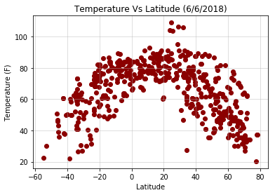

# WeatherPy

This project was focused on working with API calls. My goal was to get various information about a city’s weather (temperature, humidity, cloud coverage, and wind speed) and see how they relate to its latitude. Constraints included making sure each city was unique and that it existed in all APIs I planned to use.

Notable findings: 
* Temperature and nearness to the equator are highly corrolated; the closer to 0 degress latitude, the higher the temperature.
* Cloud coverage is not affected by the city's closeness to the equator
* The closer a city is to either pole, the more likely its humidity in nearer to 100%.


```python
import pandas as pd
import numpy as np
import random
import openweathermapy.core as owm
from config import api_key
from config import gkey
import csv
import matplotlib.pyplot as plt
import requests
import json
from citipy import citipy
```

To generate the data, I first created a random set of 500 unique latitudes and longitudes. I then used the python library citipy to get the coordinate’s closest corresponding city. It was at this point I realized there might be a problem: what happens if the random coordinate point was in the ocean, and therefore the nearest city was hundreds of miles away? To account for this, I fed the city name into Google’s API to retrieve its true coordinates. Once I had generated 500 unique cities and coordinates, I used the library openweathermappy to retrieve weather data from Openweathermap.org. Matplotlib was used to display the results.


```python
#Creating random set of 500 unique latitudes, longitudes, and corresponding city name
city_dict = {}
city_names = []
lat = []
lng = []
count = 0

while len(city_names) < 500:
    
    #Random latitudes/longitudes
    lat_try = random.randint(-900000,900000)/10000
    lng_try = random.randint(-1800000,1800000)/10000
    
    #Nearest city to those coordinates
    city = citipy.nearest_city(lat_try, lng_try).city_name
    country = citipy.nearest_city(lat_try, lng_try).country_code
    city_country = city + ", " + country
    
    #Find the city's true coordinates with Google API
    target_url = "https://maps.googleapis.com/maps/api/geocode/json?address=%s&key=%s" % (city_country, gkey)
    city_coord = requests.get(target_url).json()
    
    #Checking if city exists in Google search results
    if city_coord["status"] != "ZERO_RESULTS":
        
        #Adding only unique cities to list
        if city not in city_dict: #searching through dict instead of list to speed up processing time
            city_dict[city] = 0
            city_names.append(city)
            lat.append(city_coord["results"][0]["geometry"]["location"]["lat"])
            lng.append(city_coord["results"][0]["geometry"]["location"]["lng"])
            
            count += 1
            print(f"Retrieving Google results for city {count}: {city}.")
```

    Retrieving Google results for city 1: cape town.
    Retrieving Google results for city 2: kaitangata.
    Retrieving Google results for city 3: chokurdakh.
    Retrieving Google results for city 4: provideniya.
    Retrieving Google results for city 5: punta arenas.
    Etc.
    


```python
all_weather = []

for index in range(0, len(city_names)):
    
    #Call API to check weather of each city
    url = f"http://api.openweathermap.org/data/2.5/weather?appid={api_key}&lat={lat[index]}&lon={lng[index]}&units=imperial"
    print(f"Retrieving Results from OpenWeather Map, city {index+1}: {city_names[index]}.")
    print(f"{url}")
    weather_response = requests.get(url).json()
    
    #Add extracts to list of dictionaries
    indiv_weather = {
        "City": city_names[index],
        "Latitude": lat[index],
        "Longitude": lng[index],
        "Temperature": weather_response["main"]["temp"],
        "Humidity (%)": weather_response["main"]["humidity"],
        "Clouds (%)": weather_response["clouds"]["all"],
        "Wind (MPH)": weather_response["wind"]["speed"]
    }
    all_weather.append(indiv_weather)
```

    Retrieving Results from OpenWeather Map, city 1: cape town.
    http://api.openweathermap.org/data/2.5/weather?appid=25bc90a1196e6f153eece0bc0b0fc9eb&lat=-33.9248685&lon=18.4240553&units=imperial
    Retrieving Results from OpenWeather Map, city 2: kaitangata.
    http://api.openweathermap.org/data/2.5/weather?appid=25bc90a1196e6f153eece0bc0b0fc9eb&lat=-46.28334&lon=169.8470967&units=imperial
    Retrieving Results from OpenWeather Map, city 3: chokurdakh.
    http://api.openweathermap.org/data/2.5/weather?appid=25bc90a1196e6f153eece0bc0b0fc9eb&lat=70.622169&lon=147.916168&units=imperial
    Retrieving Results from OpenWeather Map, city 4: provideniya.
    http://api.openweathermap.org/data/2.5/weather?appid=25bc90a1196e6f153eece0bc0b0fc9eb&lat=64.43272&lon=-173.238567&units=imperial
    Retrieving Results from OpenWeather Map, city 5: punta arenas.
    http://api.openweathermap.org/data/2.5/weather?appid=25bc90a1196e6f153eece0bc0b0fc9eb&lat=-53.1638329&lon=-70.9170683&units=imperial
    Etc.
    


```python
#Create dataframe from extracted data and export to CSV
weather_df = pd.DataFrame(all_weather)
weather_df.head()

#Export to CSV
weather_df.to_excel("weather_in_cities.xlsx", index=False)
```

# Temperature
Temperature has a very direct relationship with latitude. As latitude approaches the equator, temperature goes up. Temperature goes down near the poles.


```python
plt.scatter(weather_df["Latitude"],weather_df["Temperature"], c="darkred")
plt.grid(alpha=.5)

plt.title("Temperature Vs Latitude (6/6/2018)")
plt.xlabel("Latitude")
plt.ylabel("Temperature (F)")

#Export to PNG
plt.savefig("temperature.png")

plt.show()
```





# Humidity
The correlation between humidity and latitude has two major peaks: one around -30 degrees latitude and one around 30 degrees latitude. Both poles and the equator, the most extremes of latitudes, experience the highest frequency of humidity above 60%. Polar cities are consistently very close to 100% humidity. The more temperate regions of -40 to -20 and 20 to 60 are much more likely to experience lower humidity, some of which get down to 10%.


```python
plt.scatter(weather_df["Latitude"],weather_df["Humidity (%)"], c="darkblue")
plt.grid(alpha=.5)

plt.title("Humidity Vs Latitude (6/6/2018)")
plt.xlabel("Latitude")
plt.ylabel("Humidity (%)")

#Export to PNG
plt.savefig("humidity.png")

plt.show()
```


# Cloud Coverage
There does not seem to be any correlation between cloud coverage and a city’s latitude. However it is interesting to note that many cities cluster around 0% coverage and 90% coverage.


```python
plt.scatter(weather_df["Latitude"],weather_df["Clouds (%)"], c="green")
plt.grid(alpha=.5)

plt.title("Cloud Coverage Vs Latitude (6/6/2018)")
plt.xlabel("Latitude")
plt.ylabel("Cloud (%)")

#Export to PNG
plt.savefig("clouds.png")

plt.show()
```


# Wind Speed
Wind speed is entirely not correlated with latitude. Most cities have a wind speed between 1 and 10 miles per hour, while significantly less cities have wind speeds of 10+. The highest wind speeds are found at the extreme latitudes.


```python
plt.scatter(weather_df["Latitude"],weather_df["Wind (MPH)"], c="orange")
plt.grid(alpha=.5)

plt.title("Wind Speed Vs Latitude (6/6/2018)")
plt.xlabel("Latitude")
plt.ylabel("Wind (MPH)")

#Export to PNG
plt.savefig("wind.png")

plt.show()
```


